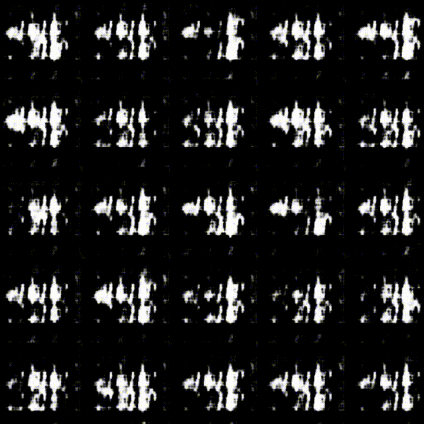
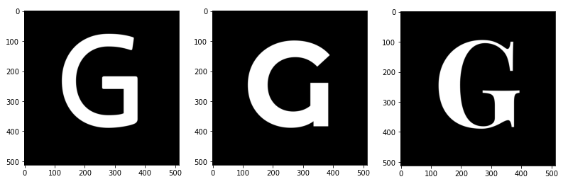

Let’s pick up from where we left off in the [last post](/blog/use-google-fonts-for-machine-learning-part1). We cleaned up the JSON annotations and exported it as a CSV file. Now, let’s load the CSV file back in, and filter them with conditions we define and generate PNG images so that we can use the images to train Convolutional Neural Networks.

## Directory Setup

Again, I am treating this post as a Jupyter Notebook, so if you want to follow along, open Jupyter Notebook in your own environment. You will also need to download Google Fonts Github repo and generate the CSV annotations. We went over all of these in [the last post](), so please check it out first.

As you can see from the tree diagram below, the Google Fonts Github repo is downloaded into input directory. All the font files are stored in ofl subdirectory, which is how it is originally set up and I have not made any changes to it. I have also set up notebook directory with .ipynb notebook (this post) as well as the CSV annotation file.

```
.
├── input
│   ├── fonts
│   │   ...
│   │   ├── ofl
│   │   ...
│   ├── fonts-master.json
└── notebook
    └── google-fonts-ml
        ├── google-fonts-ml.ipynb
        └── google-fonts-annotaion.csv
```

## Load CSV Annotations

First, we will load the CSV annotation as pandas.DataFrame.

`gist:erraticgenerator/314a406afafd6571b0d5c5f828a2776f`

# Look at Data Summary

Let’s have a look at what we are dealing with here — how many fonts are within each category, how many fonts have which variants, etc. We first filter the list of fonts using a regular expression to select the columns we want to look at. Find all the rows with the value of 1, sum all these rows, and sort by frequency.

`gist:erraticgenerator/592e80d6842f79a55a640fa2f97cd381#`

At the time of writing, for instance, there are 325 display, 311 sans-serif, and 204 serif font families. The number of fonts is not the same as the number of font files, however, because the CSV annotation is only counting the font families and there are other factors such as variable fonts, etc.

## Filtering Fonts

Now, let’s create conditions to create sub-groups of fonts. Because we took the time to create a nice CSV annotation it is easy to filter fonts according to our own criteria. Say, how many fonts that are `thin`, `regular` and `thai`?

`gist:erraticgenerator/7bfab1e8f1d8502a31f424b8750bdac1`

The reason we `sum(axis=1)` after filtering is to capture multiple columns if they meet the same condition. For example, if we filter with `italic`, there are multiple columns that will be included such as `bolditalic`, `mediumitalic`, etc. We can combine multiple conditions to a boolean Series object called `mask` and pass it to our DataFrame object. It will only return the rows that meet the conditions. We use `&` to only select the fonts that meet all the conditions.

Here is another one — Let’s find the fonts that support `chinese` and `sans-serif`.

`gist:erraticgenerator/a4b855ad83bc907097af5b10cf1fdc97`

I get 3 fonts back that meet the criteria — NotoSansHK, NotoSansSC, and NotoSansTC. For some reason, these NotoSans fonts were not included in the Google Fonts Github repo. So, you will have to manually download them if you need to use them.

We don’t want to keep editing the `mask` object each time we use a different set of filters, so we will make a list with all the filters we want to use and simply iterate over them. These strings are in fact regular expressions and you can try more advanced filtering on your own.

`gist:erraticgenerator/03f27ac0b1079cb83d3511a6560d9f96`

How about we make this into a reusable function? This function will take DataFrame and regex filter list as inputs, and outputs a list of font names.

`gist:erraticgenerator/0bfa88d8be5f3d48c6d564bfd77ea591`

## Some Caveats

Before we move on, I want to point out some issues that I found. We are relying on the font data from the CSV annotations that we generated from the Google Fonts Developer API, but there are some discrepancies.

- First, the number of fonts present in the annotations is not the same as the number of font files we downloaded.
- Some fonts that are not indicated as *latin* still have latin alphabets.
- *NotoSansTC* is present in the annotation but is not included in the zip archive. Probably because some languages such as Chinese or Korean have a lot of characters and font files get much bigger compared to latin fonts. It’s just my guess…
- A font called *Ballet* — the font file exists but it’s not in the annotation. There may be a few other cases like this.
- The name of the folder containing font files is mostly the same as the name of the fonts themselves but there are some exceptions. For example, a font called *SignikaNegative* is inside a folder called *signika*.
- A font called *BlackHanSans* is obviously a very thick black weight, but it is listed as *regular* weight.

So, the annotation is not the complete representation of the font files we downloaded. As a whole, I think it is still a very valuable resource that we have.

## Load Font File Path

We will use `glob` to load the fonts path. If you only want to filter fonts through weights such as `Regular`, `Bold`, `Thin`, simple filename checking will be enough as the weights/styles are already part of the file names, but you won't be able to use other annotations we looked at such as language subsets or category.

`gist:erraticgenerator/6b9bc56248d18f75a6d03f7f6e0060bb`

```
number of font files in total:  8708
```

## Filter Fonts

It is time to bring different pieces together into a single function that will take a DataFrame object and the path to font files, and then use the filters we define to return a list of filtered font paths.

`gist:erraticgenerator/6985c7ef6200a061310ddd688d5455fd`

To describe what the function is doing — What we want to do is to look at both `filtered_fontnames` and its corresponding file path and check if the file exists. If so, the function returns a path to the file.

From the *font* names, we can retrieve the *file* names so that we can load each font and later generate images. We filter fonts with weights, styles, subsets, and categories, but the file names only contain font names and weights/styles.

A few things to note here:

- Depending on your OS, you may need to give case-sensitive filters. For example, `Bold`, `LightItalic` may work but `bold`, `lightitalic` may not. I am using a Mac, and it is case-insensitive. You also cannot combine mutually exclusive conditions together, such as filtering `sans-serif` and `serif` at the same time. You can, however, input a regular expression to create a more complex filter.

Some variable fonts are not selected (ex. CrimsonPro, HeptaSlab) because they have different naming conventions than others. I just ignored them because they are not that many, and the variable fonts that have static versions are searchable through the filters.

## Preview Font Images

It is finally time to see the fonts displayed as images.

`gist:erraticgenerator/6b0093720bcfb41d76b523abd7965815`



## Everything Pieced Together

Here is the code block that pieces everything together. This time, all the images will be saved as PNG files.

`gist:erraticgenerator/ab3dcaf4ab0eb7ba50378fe17bc1f97f`

## Conclusion

Now, you can use the generated images as inputs to Convolutional Neural Networks such as Generative Adversarial Networks or Autoencoders. That is what I am going to be playing the images with. I am sure you can find examples of the model architectures pretty easily on Medium and elsewhere.

I hope you found my post useful — please let me know if you make some fun stuff with the fonts!