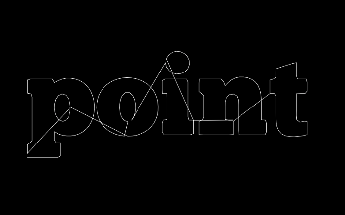
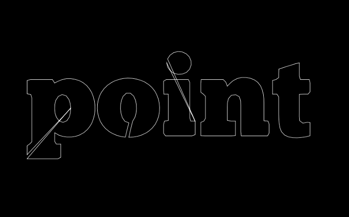
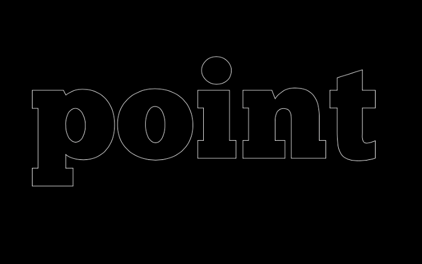

p5.js has a function called `textToPoints()` which is somewhat hidden in [the reference](https://p5js.org/reference/#/p5.Font/textToPoints). This function returns you with an array of points that are on the outline of the text. It does resampling for you (and you can control the sampling resolution) so it is great to use for quick typographic experiments. In this post, I will show you the basics of how to use it and a few use cases and challenges such as dealing with multiple letters and counter shapes (ie. holes in letters — 0 a, p, B, etc.)

## Basic Usage

The basic usage is very simple. First, you need to load an external OTF file. It only works with externally loaded font files, and because `loadFont()` is asynchronous, you will need to place the function call in `preload()` and it will be loaded before the `font` object is used in the setup and draw functions.

Next, `font.textToPoints()` function takes 4 arguments — the text you want to get points from, x and y coordinates, and what size the text will be. It also has an optional fifth argument, where you can define `samplingFactor`, which you can think of as sampling resolution and `simplifyThrehold`, which removes collinear points if you need to have a minimum number of points to draw the outlines. I suggest that you play with these values (start with something small) to get a feel for it.

Once you have all the points stored in thepts array, you can use them however you want. You can use x, y coordinates to draw lines, ellipses, etc. Here is the result of my example and the code below. I am using a beautiful open source font called [Chunk](https://www.theleagueofmoveabletype.com/chunk), but if you don’t have it, you will need to replace it with your own font file.

`gist:erraticgenerator/db8cf95b7e9c80a34f793931c75e5f8c`


## Outline of Multiple Letters

Let’s say I want to draw the outline of my text. You can simply use `beginShape()` and `endShape()` with `vertex()` function calls inside. Since we already have all the points stored in the `pts` array, the implementation is quite simple. Just replace the code inside `draw()` with this:

```js
function draw() {
  background(0)
  push()
  translate(60, height*5/8)
  noFill()
  stroke(255)
  beginShape()
  for (let i = 0; i < pts.length; i++) {
    const p = pts[i]
    vertex(p.x, p.y)
  }
  endShape()
  pop()
}
```

And you get this:



It looks pretty cool, but the problem is all the letters are connected. The `pts` array contains all the coordinates but it does not tell us when each letter starts and ends. One workaround is to use a 2-dimensional array and store the points for each letter.

`gist:erraticgenerator/745c56dd5d961beb930719871aa78800`



This is looking a lot better. In the image, the letters n and t look perfect, but we still have problems with the letters p, o and i because either they are made up of multiple shapes or there are counter shapes (holes). Unfortunately, the way the `pts` array is structured and the way p5js handles these counter shapes (using `beginContour()` and `endContour()`) did not allow me to distinguish these shapes. So, I had to turn to something else — another library called opentype.js.

## Opentype.js for More Control

In fact, p5js internally uses [opentype.js](https://opentype.js.org/) to get the text outlines, but when you directly use opentype.js to extract the text path data, it not only gives you the x and y coordinates but also SVG commands that are associated with the points. We can use this data to find out when a path should start and end. You can look more into the SVG spec on [the W3 website](https://www.w3.org/TR/SVG/paths.html). I will summarize what we need to know here:

- M: `moveTo()` command; p5 equivalent is `beginShape()` and `vertex()`
- L: `lineTo()` command; p5 equivalent is `vertex()`
- C: `bezierCurveTo()` command; p5 equivalent is `bezierVertex()`
- Q: `quadraticCurveTo()` command; p5 equivalent is `quadraticVertex()`
- Z: `closePath()` command; p5 equivalent is `endShape()`

Also, the way opentype.js loads a font is a bit different so we will also need to change that part of the code. Here is the full working code:

`gist:erraticgenerator/e20cc8c8806ae89d077ceaf962d913af`



Now, we have very clean outlines with all the properly separated counter shapes! Now, with this path data, you can draw anything you want. Maybe, convert the points to `p5.Vector` and do physical simulations?

One caveat here is that the path data we get from the opentype.js is from the original font data and it does not automatically resample them just like how p5js’ `textToPoints()` did. The post is getting long so I won’t cover it here but the P.3 section of the [Generative Design website](http://www.generative-gestaltung.de/2/) has many great examples you should definitely check out. I hope you have fun experimenting with fonts!
