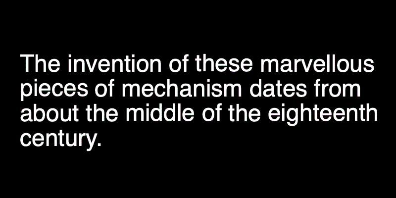
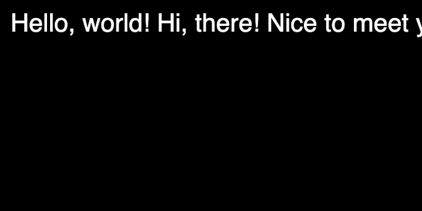
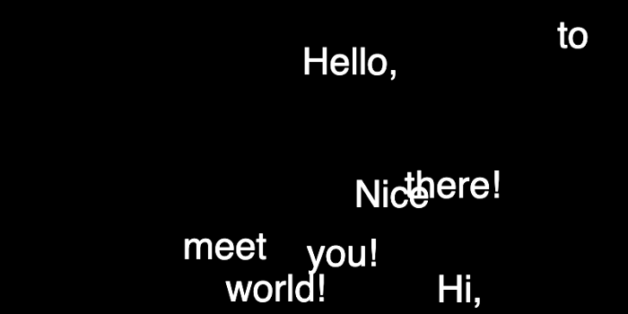

In this post, I would like to show you how to make the text animation where you can have control over individual words. We will also store its original position so that you can return back. We will use a JavaScript library called p5.js. If you are not familiar with the library, check out [their website](https://p5js.org/). It is designed to be beginner-friendly for creating audio-visual-interaction on the web.

Here is a breakdown on what we will look at. First, we will write down some text but instead of storing in a single `string` we will break them down into individual words so that our program will remember its original position. We will store each word along with its position in JS objects. That’s where we will also implement methods for animation.

## Display Individual Words

p5.js has the `text()` where you can pass the message and coordinates to display on the canvas. For example, this will display ‘Hello, world!’ on screen:

```js
const str = 'Hello, world!'
text(str, 20, 20)
```

If you want to animate the whole phrase, this is fine, but if you want to animate each word differently, we will need to use a different data structure since we don’t know exactly at what pixel coordinate the second word will start. We can split the string whenever there is an empty space between words and store them in an array. This is easy with the `split()` function:

```js
const wordsStr = str.split(' ')
```

We will then iterate over each word and determine the position of the next words. How to know where to place the next words? p5js has the `textWidth()` function, which will return the width of any text given in pixels. Note that this width value is dependent on the current text size. Let’s look at what we have so far:

`gist:erraticgenerator/a504622c3b5f249bda36d374d6adeb13`



This is going great, but we have a problem that when the text is too long, it goes beyond the screen width. To fix that, we need to check the next word’s width and if it won’t fit in the remaining space, we will need to do a line break.

```js
// in the same for loop
x = x + wordStrWidth + textWidth(' ')
// look ahead the next word - will it fit in the space? if not, line break
const nextWordStrWidth = textWidth(wordsStr[i+1]) || 0
if (x > width - nextWordStrWidth) {
    y += 40 // line height, sort of
    x = 20 // reset x position
}
```

## Word Class and objects

The next step is to store the x and y positions of each word so that we can retrieve them later in our program. Right now, these x and y values are only local variables, so it is difficult to use them again in other functions. So, we will create a class `Word` for each word, and inside, we can store the word text itself as well as x/y values and more. Here is the definition of that class:

```js
class Word {
    constructor(word, x, y, idx) {
        this.word = word
        this.x = x
        this.y = y
        this.idx = idx
        this.fcolor = color(255)
    }
display() {
        fill(this.fcolor)
        noStroke()
        text(this.word, this.x, this.y)
    }
}
```

This is very basic, but we will add more methods a little later. We also store the index value as this may come in handy in the future. Now, instead of directly using the `text()` function, let’s create objects out of this class and use the `word.display()` method:

`gist:erraticgenerator/a1eea86098eb5c4a8c93f41b9f4a285c`

All the data we need is now part of word objects, and we can retrieve its values anytime we need. Try changing the `str` text message itself, and it will nicely adapt to the new text at any length.

## Animate Each Word

Because we now have a good structure, adding animation will be just adding more methods to the `Word` class. We will create an `update()` method, which will be run every frame in the main `draw()` loop. And for animation, I will use `lerp()` function and move the words 10% closer to our target each frame:

```js
this.x = lerp(this.x, this.tx, 0.1)
this.y = lerp(this.y, this.ty, 0.1)
```

Of course, `this.tx` and `this.ty` are new variables, so we will have to define it in the constructor. In the beginning, `this.x` and `this.tx` will be the same, so there will be no animation as the target is the same as the current position, but I will randomize the target position whenever we press the mouse. Here is the implementation:

`gist:erraticgenerator/03603f13a91cc5ed7ee1364adc72ce8c`



## Bring Them Back

One last thing to do is to bring all the words back to where it started. We need to update `this.x` and `this.y` to be able to animate the words, so the moment it starts to animate, the word object loses its original position. We will need to create new variables so each word will always remember its original position.

```js
// in Word class
constructor(word, x, y, idx) {
    this.word = word
    this.x = x
    this.y = y
    // target position is the same as current position at start
    this.tx = this.x
    this.ty = this.y
    // original position
    this.origx = this.x
    this.origy = this.y
    this.idx = idx
    this.fcolor = color(255)
}
```

Let’s also add one more method in the `Word` class to reset x and y positions to their original values:

```js
// in Word class
reset() {
    this.tx = this.origx
    this.ty = this.origy
}
```

Now, we have multiple actions to control, I am moving some parts of the code from `mousePressed()` to `keyPressed()`.

```js
function keyPressed() {
    if (key === 'r') {
        for (let word of words) word.spread()
    } else if (key === ' ') {
        for (let word of words) word.reset()
    }
}
```

And finally, here is the full implementation.

`gist:erraticgenerator/83b6b76088b1455363ec809988149c23`

## Wrap-up

I hope my breakdown was helpful to you. In terms of what to do next, I suggest that you try different animation methods. I used `lerp()` for simplicity but you can replace it with any types of easing methods and you will get very different looking results. Also, you can add more variables than just x and y positions. How about color or text size animation? How about breaking up the words into letters? I hope you have some fun!
