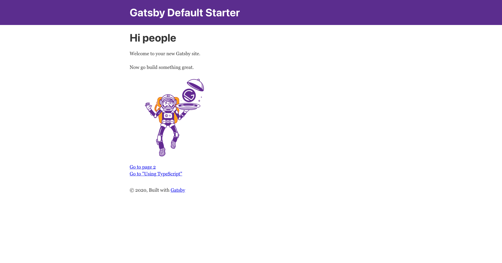
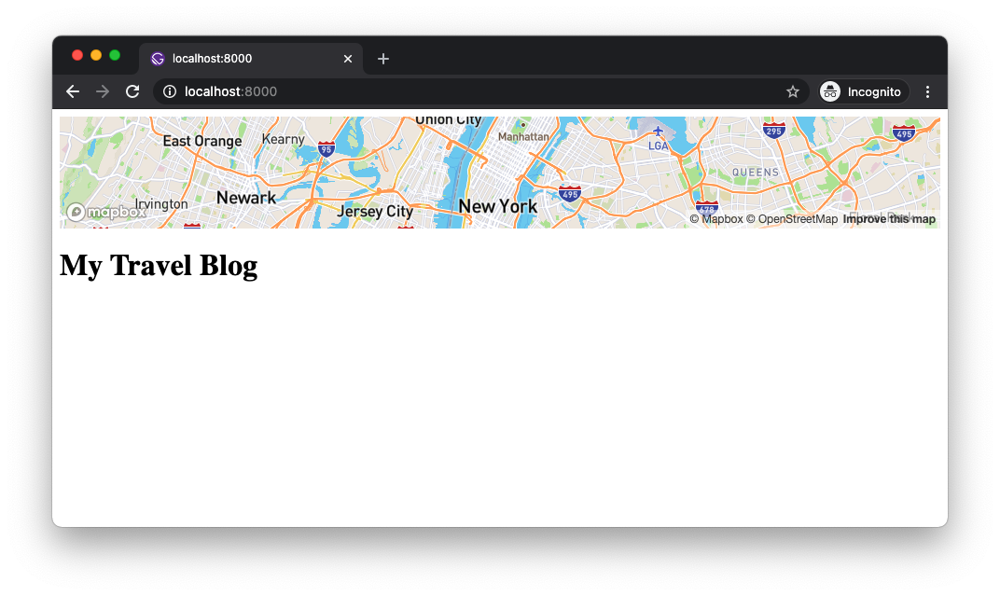
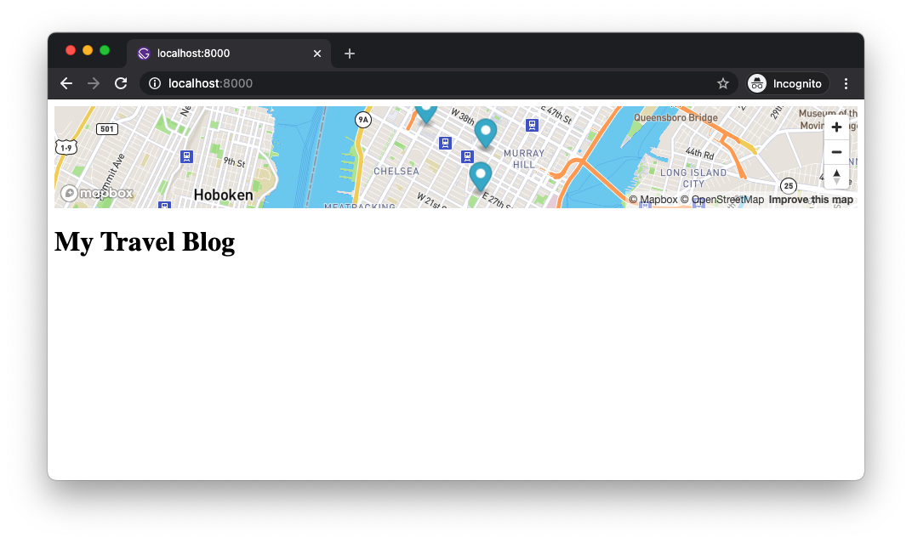
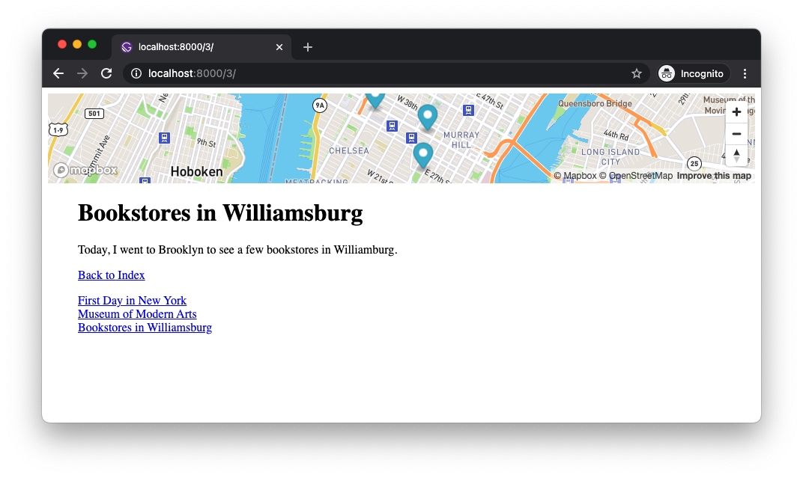
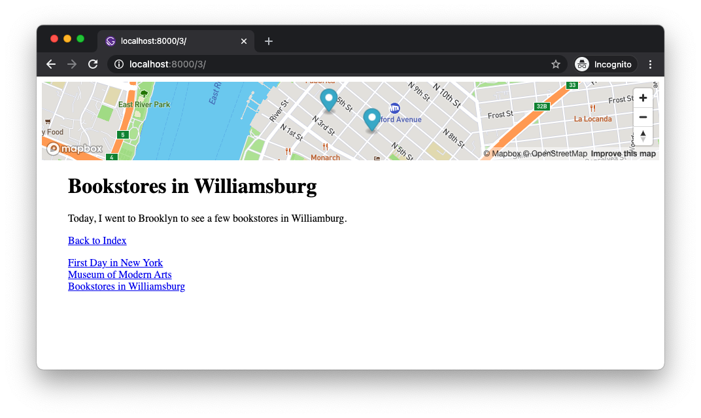

`gist:erraticgenerator/a504622c3b5f249bda36d374d6adeb13`

I love making websites with Gatsbyjs and recently started using Mapbox, so I thought I could combine the two. The idea is to create a travel blog (of course, traveling after the virus goes away) where the map will support the text content by dynamically zooming into the area of interest and putting markers of the places I visit. And when navigating between different posts, the map will continuously highlight the new areas instead of refreshing the whole page each time. This will give a better context to the readers.

Before I dive in, I just want to let you know that I am still learning React and this post is more of the documentation of my learning process, rather than a full tutorial. But I will do my best to highlight some mistakes and key findings I made through the process. It was a really great exercise for me to get familiar with Gatsby and Mabpx GL JS API as well as using React hooks with functional components. If you have any suggestions on better or more efficient ways of doing things, please leave it in the comments so me and others can learn from it.

- summarize key points
- why not use a wrapper library

## Setup

I will not go over every single detail or every single line of code but I will include the Github repo at the end of the post if you want to try it out yourself. I also assume you have a basic familiarity with Gatsby and React, and have installed the basic dependencies to make Gatsby working.

First thing to do is to create an empty Gatsby project. I will use one of their basic starters just so I don't have to create and configure everything, but we will delete almost all the files that come with it so we can only focus on working with the Mapbox map. We will create a bare bone structure, which you can adapt to your own needs.

```bash
$ gatsby new gatsby-mapbox-blog
```

After creating the project, `cd` into it and run `gatsby develop`, and you will see this screen:



Let's delete almost all the files in the `src` folder except `components/layout.js` and `pages/index.js`. After deleting, it will complain about missing files, so we will also need to clean up each file and remove any unnecessary components and html codes from them. (If you have experience with Gatsby, you can either leave them be or add them back later.)

```js
// index.js
import React from "react"
import Layout from "../components/layout"

const IndexPage = () => (
  <Layout>
    <h1>My Travel Blog</h1>
  </Layout>
)

export default IndexPage
```

```js
// layout.js
import React from "react"
import PropTypes from "prop-types"

const Layout = ({ children }) => {
  return (
      <div>
        <main>{children}</main>
      </div>
  )
}

Layout.propTypes = {
  children: PropTypes.node.isRequired,
}

export default Layout
```

One more thing I did was to clean up `gatsby-config.js` Again, I wanted to start with a bare minimum, so I removed a lot of stuff, and also changed the file source path to `content` so be sure to create a folder named `content` in the root of your project. We don't need it right now, but this is where I will be creating Markdown files for blog posts later.

```js
module.exports = {
  siteMetadata: {
    title: `Gatsby Mapbox Blog`,
    description: ``,
    author: `Erratic Generator`,
  },
  plugins: [
    `gatsby-plugin-react-helmet`,
    {
      resolve: `gatsby-source-filesystem`,
      options: {
        name: `content`,
        path: `${__dirname}/content`,
      },
    },
    `gatsby-transformer-sharp`,
    `gatsby-plugin-sharp`,
  ],
}
```

It's probably a good idea to restart your development server at this point just to make sure there is no error. so run `gatsby develop` again and if you don't see any error messages, you are good to move to the next step.

## Install Mapbox

We will install Mapbox GL JS from NPM. You can follow [their guide](https://www.mapbox.com/install/js/) but basically, you only need to run this command in the terminal:

```bash
$ npm install mapbox-gl --save
```

It also needs a stylesheet to display the map properly. You can include this CSS in the `<head>` of any HTML page with the map, but I will later add it in my component by directly importing from the npm module. It's up to you.

```html
<link href='https://api.mapbox.com/mapbox-gl-js/v2.0.0/mapbox-gl.css' rel='stylesheet' />
```


## Display The Map

I want the same map to be shared across multiple blog posts, so instead of adding a map on every page, I will instead add it the the Layout component, because every page that I will be creating will be wrapped with the component. And to keep the code clean and reusable, I will make a separate component called `Map`. Let's create `components/map.js` 

```js
// map.js
import React, { useRef, useEffect, useState } from "react"
import mapboxgl from "mapbox-gl"
import "mapbox-gl/dist/mapbox-gl.css"

const MAPBOX_TOKEN =
  "pk.eyJ1IjoiY2RhZWluIiwiYSI6ImNpbW5weWxodTAwMGt1YW0xZmF6a2M0c3AifQ.FJaLocnH6vf86TDuX69f6w"

const mapContainerStyle = {
  width: "100%",
  height: "120px",
}

const Map = () => {
  const mapContainerRef = useRef(null)

  const [map, setMap] = useState(null)

  useEffect(() => {
    const map = new mapboxgl.Map({
      container: mapContainerRef.current,
      accessToken: MAPBOX_TOKEN,
      style: "mapbox://styles/mapbox/streets-v11",
      // Empire State Building [lng, lat]
      center: [-73.9856, 40.7497],
      zoom: 10,
    })
		map.addControl(new mapboxgl.NavigationControl(), "top-right")

    setMap(map)

    return () => map.remove()
  }, [])

  return <div ref={mapContainerRef} style={mapContainerStyle} />
}

export default Map

```

And include a Map component in `layout.js`

```js
// layout.js
import React from "react"
import PropTypes from "prop-types"
import Map from "./map"

const Layout = ({ children }) => {
  return (
    <>
      <Map />
      <main>{children}</main>
    </>
  )
}

Layout.propTypes = {
  children: PropTypes.node.isRequired,
}

export default Layout
```



A few things happening here. First, you will need to create a free [Mapbox](https://mapbox) account to get an `accessToken` to be able to use the map on your website. I think their free plan is very generous for doing all the local development as well as publishing small personal projects. 

And I am using React hooks - `useRef()` to access the map container DOM element. `useState()` to store the map object as a state so that I can use the value in other parts of the component, and `useEffect()` to create the map object when the component mounts. The empty dependency array as second argument to the `useEffect()` is important. I made many mistakes with this argument through the project. If you remove the second argument you will notice it will go into an endless loop. This is because `useEffect()` runs when there is a change in states, and we are using `setMap(map)` in the hook, it keeps on running and running again. Having the empty array will only run the effect hook only once when the components mount, which is what we need because we only want to create a new map once and use the same map afterwards. `return () => map.remove()` is to clean up when the component unmounts.


## Add Place Markers
Now, let's add some markers on the map. Each blog post will contain an array of places and I want to create a marker for each. Eventually, this will be handled through the frontmatter of my Markdown files, but for now, let's create a simple object with the coordinates as data source.

```js
// on top of map.js
const places = [
  {
    name: "Empire State Building",
    longitude: -73.9856,
    latitude: 40.7497,
  },
  {
    name: "Birch Coffee",
    longitude: -73.9864,
    latitude: 40.7438,
  },
  {
    name: "B&H",
    longitude: -73.9961,
    latitude: 40.753,
  },
]
```

I am manually creating data for each place. I got the coordinates by right-clicking on Google map. What would be much better is that we supply the name or address of a place, and let the API figure out the coordinates. That is what I eventually ended up implementing, but I am not covering it here to keep this post concise. If you're interested in it, take a look at [Mapbox Geocoding API](https://docs.mapbox.com/api/search/geocoding/), which does exactly that. One mistake I made was to try using batch geocoding. After a few failed attempts, I realized it is only for paid customers. But you can still make multiple requests, one at a time.


Now, back to our markers... I will create new components `Marker` and `Markers` in a file `markers.js`

```js
// markers.js
import React, { useRef, useEffect } from "react"
import mapboxgl from "mapbox-gl"

const Marker = ({ map, place }) => {
  const markerRef = useRef()

  useEffect(() => {
    const marker = new mapboxgl.Marker(markerRef)
      .setLngLat([place.longitude, place.latitude])
      .addTo(map)

    return () => marker.remove()
  })

  return <div ref={markerRef} />
}

const Markers = ({ map, places }) => {
  return (
    <>
      {places &&
        places.map(place => (
          <Marker key={place.name} map={map} place={place} />
        ))}
    </>
  )
}

export default Markers
```

I am taking a very similar approach to what I have done to the Map component. the `Markers` component will get two props from the `Map` component - a reference to the map and the places data, which will be passed onto the `Marker` components, that will handle adding the markers to the map.

Now, we need to use the `Markers` component in our `Map` component. But before that, I will use the [Turf.js library](http://turfjs.org) to calculate the bounding box of multiple coordinates so that the map can re-center itself based on the markers present on each page. I am also installing the `@turf/helpers` to convert the coordinates into geojson objects as that is what turfjs functions expect as input.


```bash
$ npm install @turf/bbox @turf/helpers
```

In the `map.js`, I will create a new `useEffect()` hook. The first effect hook we used was to run once to create a new map, but the markers will be created and removed many times whenever we navigate between pages, so the new effect hook with different dependency array will be necessary. 

```js
// in map.js

// add new modules
import React, { useRef, useEffect, useState } from "react"
import mapboxgl from "mapbox-gl"
import bbox from "@turf/bbox"
import { multiPoint } from "@turf/helpers"
import Markers from "./markers"
import "mapbox-gl/dist/mapbox-gl.css"

// ... variables

const Map = () => {
	// ... ref, state, useEffect

	// add new effect hook
  useEffect(() => {
    if (!map) return

    if (places.length !== 0) {
      const coords = []
      places.forEach(place => {
        coords.push([place.longitude, place.latitude])
      })
      const feature = multiPoint(coords)
      const box = bbox(feature)

      map.fitBounds(
        [
          [box[0], box[1]],
          [box[2], box[3]],
        ],
        {
          padding: 20,
          maxZoom: 14,
          duration: 2000,
        }
      )
    } else {
      map.easeTo({
        center: [-73.9856, 40.7497],
        zoom: 10,
        duration: 2000,
      })
    }
  }, [map])

  return (
    <div ref={mapContainerRef} style={mapContainerStyle}>
      {places && map && <Markers map={map} places={places} />}
    </div>
  )
}

export default Map
```



We now have nice markers on the map for the Empire State Building, Birch Coffee (one of my favorites) and B&H store. Play with `places` array to add more markers. What is really nice about Mapbox is that it provides very useful methods like `fitBounds()` and `easeTo()`, and with the latter, we get a very smooth transition animation for free. There are more animation options you can add. I encourage you to look at the Mapbox documentation.


## Add Markdown Files
It's time to use the data from real blog posts instead of a simple `places` object. I created a few Markdown `.md` files in the `content` folder with the frontmatter that include the places data.

Here is an example (`content/1.md`):

```md
---
title: First Day in New York
date: 2020-12-27
places:
- {
	name: "Empire State Building",
	longitude: -73.9856,
	latitude: 40.7497,
}
- {
	name: "Birch Coffee",
	longitude: -73.9864,
	latitude: 40.7438,
}
---

I went to the Empire State Building and had a coffe at Birch Coffee.
```

## Generate Pages through Gatsby Node API

To source data from Markdown posts and generate pages in Gatsby, there are a few extra steps to take. This is another topic so I won't explain much other than showing you the code necessary to run our project.

Install a Gatsby plugin.

```bash
$ npm install gatsby-transformer-remark
```

Then, update `gatsby-config.js` to include the plugin, `gatsby-transformer-remark`.

Then, update `gatsby-node.js`

```js
// gatsby-node.js
const path = require('path')
const { createFilePath } = require(`gatsby-source-filesystem`)

exports.onCreateNode = ({ node, getNode, actions }) => {
  const { createNodeField } = actions
  if (node.internal.type === 'MarkdownRemark') {
    const slug = createFilePath({ node, getNode })
    createNodeField({
      node,
      name: `slug`,
      value: slug
    })
  }
}

exports.createPages = async ({ graphql, actions }) => {
  const { createPage } = actions
  const result = await graphql(`
    query {
      allMarkdownRemark {
        edges {
          node {
            fields {
              slug
            }
          }
        }
      }
    }
  `)

  result.data.allMarkdownRemark.edges.forEach(({ node }) => {
    createPage({
      path: node.fields.slug,
      component: path.resolve(`./src/templates/postTemplate.js`),
      context: {
        slug: node.fields.slug
      }
    })
  })
}
```

We need `./src/templates/postTemplate.js`, which will be used as a template for our Markdown files.

```js
// postTemplate.js
import React from 'react'
import { Link, graphql } from 'gatsby'
import Layout from "../components/layout"

const PostTemplate = ({ data }) => {
  const frontmatter = data.markdownRemark.frontmatter
  const html = data.markdownRemark.html

  return (
    <Layout>
      <div>
        <h1>{frontmatter.title}</h1>
        <h2>{frontmatter.date}</h2>
        <div dangerouslySetInnerHTML={{ __html: html }} />
      </div>
      <Link to='/'>Back to Index</Link>
    </Layout>
  )
}

export default PostTemplate

export const pageQuery = graphql`
  query($slug: String!) {
    markdownRemark(fields: { slug: { eq: $slug }}) {
      html
      frontmatter {
        title
        places {
          name
          longitude
          latitude
        }
      }
    }
  }
`
```

## Add Navigation

At this point, you will need to restart the development server. If everything went well, Gatsby would have generated pages for you. Let's add a simple navigation in a new `PostList` component in `postList.js` We use `useStaticQuery` to make GraphQL queries from a component, not from a page.

```js
// postList.js
import React from "react"
import { Link, graphql, useStaticQuery } from "gatsby"

const query = graphql`
  query MyQuery {
    allMarkdownRemark {
      nodes {
        frontmatter {
          title
        }
        fields {
          slug
        }
      }
    }
  }
`

const PostList = () => {
  const data = useStaticQuery(query)
  const nodes = data.allMarkdownRemark.nodes

  return (
    <ul
      style={{
        listStyleType: "none",
        padding: 0,
      }}
    >
      {nodes.map(node => {
        const title = node.frontmatter.title
        return (
          <li key={title}>
            <Link to={node.fields.slug}>{title}</Link>
          </li>
        )
      })}
    </ul>
  )
}

export default PostList
```

And include it in `layout.js`

```js
// layout.js
import React from "react"
import PropTypes from "prop-types"
import Map from "./map"
import PostList from './postList'

const Layout = ({ children }) => {
  return (
    <>
      <Map />
      <div style={{ margin: '0 40px' }}>
        <main>{children}</main>
        <PostList />
      </div>
    </>
  )
}

Layout.propTypes = {
  children: PropTypes.node.isRequired,
}

export default Layout
```




We can now navigate between pages, but There are a few issues. First, on each page load, the map reloads, which causes unnecessary API calls and also break the user experience. Another ovbious things is that the markers on all pages are the same because we have not yet connected GraphQL query data back to our map. We will need props to handle that.

## Gatsby Browser API

At first, I thought that the `Layout` component will not reload on every page because it is wrapping the children, but later discovered that's not the case as you can see from [the Gatsby website's explanation](https://www.gatsbyjs.com/docs/how-to/routing/layout-components/#how-to-prevent-layout-components-from-unmounting). That means we will need to remove the wrapping `Layout` component from our pages and use the `wrapPageElement` browser API. I never used this API before so it was a learning experience. The implementation itself is very simple, and you can find more info on [the API reference](https://www.gatsbyjs.com/docs/reference/config-files/gatsby-browser/#wrapPageElement). Don't forget to remove all the layout components you are using in each page and template, otherwise, you will see the map rendered twice.

```js
const React = require('react')
const Layout = require('./src/components/layout').default

exports.wrapPageElement = ({ element, props }) => {
  return <Layout {...props}>{element}</Layout>
}
```

Now, when you navigate between pages, the map stays the same. What's nice is that you can still use any props that your page receives and pass them to the layout. We need this to pass the places data from our page to the map in the `Layout` component.

## Update Map Component To Use Props

To send differen places data from each page to our `Map` component, we need to update the `Map` component to take props.

```js
// in map.js

// ... remove const places

// update paces to props.places
const Map = props => {
	// ...

  useEffect(() => {
    if (!map) return

    if (props.places && props.places.length !== 0) {
      const coords = []
      props.places.forEach(place => {
        coords.push([place.longitude, place.latitude])
      })
      const feature = multiPoint(coords)
      const box = bbox(feature)

      map.fitBounds(
        [
          [box[0], box[1]],
          [box[2], box[3]],
        ],
        {
          padding: 20,
          maxZoom: 14,
          duration: 2000,
        }
      )
    } else {
      map.easeTo({
        center: [-73.9856, 40.7497],
        zoom: 10,
        duration: 2000,
      })
    }
  }, [map, props.places])

  return (
    <div ref={mapContainerRef} style={mapContainerStyle}>
      {props.places && map && <Markers map={map} places={props.places} />}
    </div>
  )
}
```

## Send Places Data to Layout Component

Lastly, send the places data to the `Layout` component, which will then be passed onto the `Map` component. I am using `useState()` hook because places data will be different for each page and I need to update the values accordingly. `useEffect()` hook will make sure it is updated only when `props` are updated.

```js
// layout.js
import React, { useState, useEffect } from "react"
import PropTypes from "prop-types"
import Map from "./map"
import PostList from './postList'

const Layout = props => {
  const children = props.children
  const [places, setPlaces] = useState([])

  useEffect(() => {
    if (props && props.data) {
      setPlaces(props.data.markdownRemark.frontmatter.places)
    } else {
      setPlaces([])
    }
  }, [props])

  return (
    <>
      <Map places={places} />
      <div style={{ margin: '0 40px' }}>
        <main>{children}</main>
        <PostList />
      </div>
    </>
  )
}

Layout.propTypes = {
  children: PropTypes.node.isRequired,
}

export default Layout

```



## Everything
Here is a repo with the complete code. There is basically no styling because I wanted to keep it simple and focus on the main task. Feel free to use it to make your own website.

https://github.com/..........

## Next steps
Knowing what to store in `useRef()` or `useState()`, and when to call `useEffect()` will be something to keep an eye on. I am excited to do more experiments with the Mapbox and here are some suggestions for things to do next:

- Add popup information on each place marker
- Add custom marker design (ie. SVG)
- Add marker animation
- Add custom map styles


## References
Here are some references that I found very useful.

- [Mapbox React examples repo](https://github.com/mapbox/mapbox-react-examples): There are only a few examples but I got a lot of help from the repo as they covered almost everything I needed to know.
- [Mapbox tutorials]: Most of them are in vanilla JS but using the hooks we covered in this post, I think it would be fairly simple to translate them to React.
