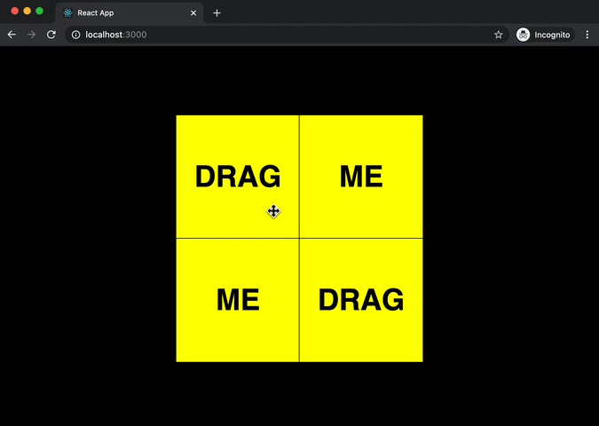

In this post, I would like to document my process of learning to use `react-draggable` component. The basic usage is quite simple - you only need to wrap your element with a `Draggable` component. To learn how, you can refer to [the original repo](https://github.com/STRML/react-draggable) or read [a write up by Victoria Lo](https://medium.com/javascript-in-plain-english/making-draggable-components-in-react-4c6d4d1df95f) on Medium. 

What I wanted to do was a little different in that I not only wanted to drag elements but also attach CSS transition animation to them, and that's what I want to cover in this post. 

## Setup

I will use `create-react-app` for simplicity.

```bash
$ npx create-react-app react-drag-test
```

And then, install dependencies. I am also using [Emotion](https://emotion.sh/docs/styled) css-in-js library for styling because I will be passing a prop to Emotion's styled-component later.

```bash
$ npm i react-draggable @emotion/react @emotion/styled
```

When you have everything ready, clean up what's in `App.js` and start your local dev server.

```
$ npm start
```

## Basic Usage

The basic usage of `react-draggable` is explained in the links I posted above so I won't spend too much time on it. I am creating a simple `div` as an Emotion's styled component. You only need to wrap your `div` with `Draggable` component. Note that the draggable can only have a single child so if you have multiple elements, make sure you create another level of hierarchy with either `div` or `span`.

```jsx
import Draggable from "react-draggable";
import styled from "@emotion/styled";

const Box = styled.div`
  width: 200px;
  height: 200px;
  border: 1px solid black;
  cursor: move;
`;

function App() {
  return (
    <Draggable>
      <Box>Drag me.</Box>
    </Draggable>
  );
}

export default App;
```

Now, you can drag your box! It's that easy. If you look at your browser's dev tool, you will notice that the Draggable component does not create any new DOM element, instead, it adds CSS `transform` property to its immediate child to translate from its original position.

## Multiple Draggables

What if you have multiple elements, for example, a list of elements that you want to drag? You can wrap each element with `Draggable` component and supply a `key` prop.

```jsx
const List = styled.ul`
  margin: 0 auto;
  padding: 0;
  width: 400px;
  background-color: gray;
  display: grid;
  grid-template-columns: 1fr 1fr;
  grid-template-rows: 1fr 1fr;
  list-style-type: none;
`;

const Box = styled.li`
  height: 200px;
  border: 1px solid black;
  background: yellow;
  cursor: move;
`;

const list = [`First`, `Second`, `Third`, `Fourth`];

function App() {
  return (
    <List>
      {list.map((item, idx) => {
        return (
          <Draggable key={idx}>
            <Box>{item}</Box>
          </Draggable>
        );
      })}
    </List>
  );
}

export default App;
```


## Event Handlers

Let's come back to a single draggable item, and take a look at event handlers. You can log what types of data are being passed on, including the basic `x` and `y`, `screenX` and `screenY`, and more. 

```jsx
function App() {
  const eventLogger = (e, data) => {
    console.log("Event: ", e);
    console.log("Data: ", data);
  };

  return (
    <Draggable onStart={eventLogger} onDrag={eventLogger} onStop={eventLogger}>
      <Box>Drag me</Box>
    </Draggable>
  );
}

export default App;
```

## Controlled element

You can also pass the `position` prop and the position will be *controlled*. You can still drag the element but the moment you release the mouse, it will snap back because it is controlled by the value set in `position`. If you want to completely disable the dragging behavior, you can pass `disabled` prop and set its value to `false`.

```jsx
<Draggable position={{ x: 0, y: 0 }}>
  <Box>Drag me</Box>
</Draggable>
```

I wanted it to have a nice transition animation when the element returns instead of jumping back. `Draggable` adds `transform: translate(x, y)` to the CSS of its immediate child and the translate value is only an offset value, so, if we can set the values back to `(0, 0)`, we can easily return it back to its original position. My first thought was adding a CSS transition to `transform` property.

```jsx
const Box = styled.div`
  /* basic styling here */

  transition: transform 0.3s;
`;
```

The code above sort of worked but the transition was also activated when I was dragging the element which made using it very difficult and annoying.

Instead of setting the `position` prop directly, I decided to set it through the `onDrag` event handler. To store and update position value, I added a `position` state.

```jsx
import { useState } from 'react'
import Draggable from "react-draggable";
import styled from "@emotion/styled";

const Box = styled.div`
  width: 200px;
  height: 200px;
  border: 1px solid black;
  background: yellow;
  cursor: move;
  transition: transform 0.3s;
`;

function App() {
  const [position, setPosition] = useState({ x: 0, y: 0 })

  const handleDrag = (e, data) => {
    setPosition({ x: data.x, y: data.y })    
  };

  return (
    <Draggable position={position} onDrag={handleDrag}>
      <Box>Drag me</Box>
    </Draggable>
  );
}

export default App;
```

It's the same as the basic example earlier, but now I have the `position` prop and I can update its values manually. I want to disable transition when I am dragging the element, and bring the transition back when I am not dragging it. Basically, I need to *toggle* the CSS transition state through the event handlers. To toggle the transition, I need to introduce another state `isControlled`.

## Putting It All Together

Below is the complete code example. The changes here are the introduction of `props` in the styled component. You can pass any props like in a regular React component and use them in your styling. I also added `handleStart` and `handleStop` to toggle the `isControlled` value as well as resetting the `position` value.

```jsx
import { useState } from "react";
import Draggable from "react-draggable";
import styled from "@emotion/styled";

const Box = styled.div`
  width: 200px;
  height: 200px;
  border: 1px solid black;
  background: yellow;
  cursor: move;
  transition: ${props => props.isControlled ? `transform 0.3s` : `none`};
`;

function App() {
  const [position, setPosition] = useState({ x: 0, y: 0 });
  const [isControlled, setIsControlled] = useState(true);

  const handleStart = () => {
    setIsControlled(false)
  }
  const handleDrag = (e, data) => {
    setPosition({ x: data.x, y: data.y });
  };
  const handleStop = () => {
    setIsControlled(true)
    setPosition({x:0, y:0})
  }

  return (
    <Draggable
      position={position}
      onStart={handleStart}
      onDrag={handleDrag}
      onStop={handleStop}
    >
      <Box isControlled={isControlled}>Drag me</Box>
    </Draggable>
  );
}

export default App;
```

## Wrap-up

Starting with this basic example, I was able to combine both dragging and animation at any point in my program. There are quite a few more props you can use in a `Draggable` component so I suggest that you check out the original repo and their example. I found `defaultPosition` and `bounds` to be very helpful.

Lastly, here is a tip if you want to drag an image element. Set `` otherwise, it will try to drag the image out of your browser. That `draggable` attribute is not part of React or `react-draggable` package. It is [a pure HTML attribute](https://developer.mozilla.org/en-US/docs/Web/HTML/Global_attributes/draggable).

I hope this post was helpful for you, and if you have a suggestion to make this better, please let me know.

## References
- React Draggable Github Repo: https://github.com/STRML/react-draggable
- Official Example: http://strml.github.io/react-draggable/example/