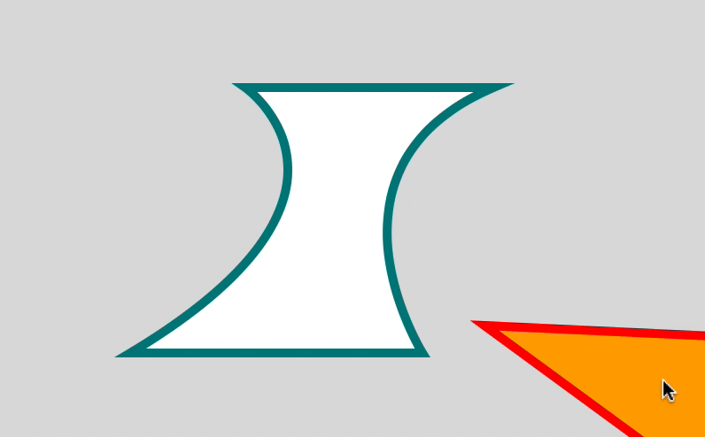
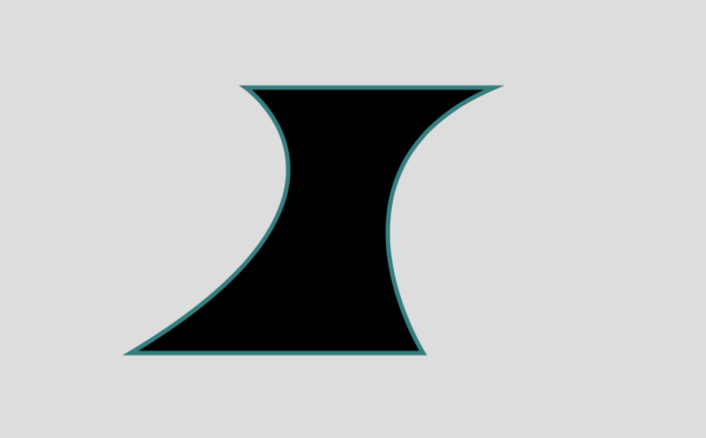
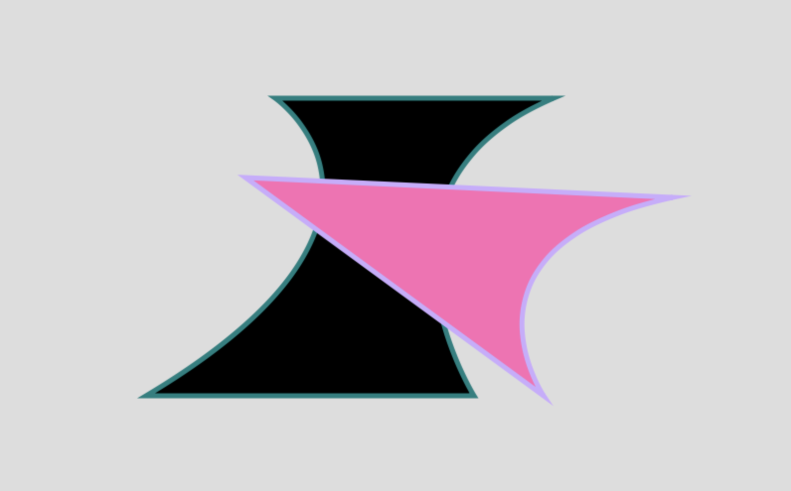
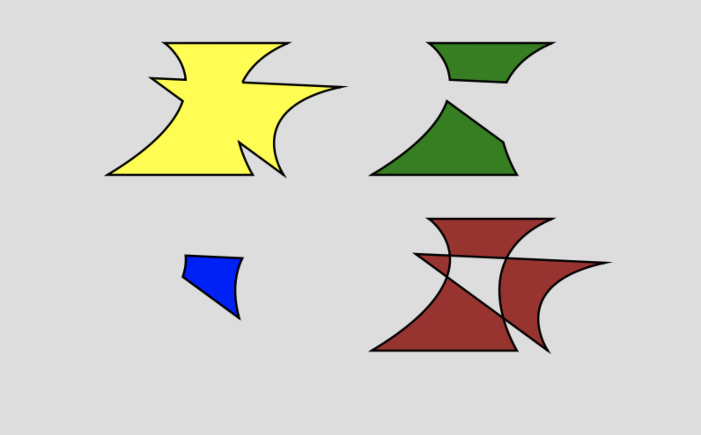

In this post, I will look at how to handle vector graphics boolean operations such as union, difference, intersection or xor, in the HTML5 Canvas. The boolean operations are very common and useful for any designer. If you regularly use Adobe Illustrator to create graphic elements, you must be familiar with the Pathfinder panel that lets you use these operations. 

## Why vector boolean ops?

Let's say you want to get an intersection of two shapes. One way to think about it is from the perspective of bitmap images. You can access individual pixels and create an image mask or use one of the many blend modes (ie. multiply, difference, etc.) This approach certainly works if you mainly work with images, but if your graphics are vector-based, then, handling the intersection with boolean operations, not pixels, will give you back newly created vector shapes, which you can further edit by manipulating individual points or adding a stroke, for example.

## Using g.js

It will be fairly complex to implement by ourselves, so I decided to use a library called g.js. It is a JavaScript graphics library from the Nodebox team, and its simple methods make it very easy to do complex vector graphics operations. I will first show you how to use g.js to create paths and also how to combine the library with another canvas-based library p5.js at the end.

Let's first set up `index.html` and connect a `canvas` to our script. Then, add the library in the `head`. You can either [download the library](https://github.com/nodebox/g.js) or use the CDN as below:

```html
<!DOCTYPE html>
<html lang="en">
  <head>
    <meta charset="UTF-8" />
    <meta name="viewport" content="width=device-width, initial-scale=1.0" />
    <title>Document</title>
    <script src="https://cdn.rawgit.com/nodebox/g.js/master/dist/g.min.js"></script>
  </head>
  <body>
    <canvas id="canvas"></canvas>
    <script>
      const canvas = document.querySelector("#canvas");
      const ctx = canvas.getContext("2d");
      canvas.width = 800
      canvas.height = 500
  
  	  // write drawing codes below

    </script>
  </body>
</html>
```

`g.js` comes with many primitive shapes such as rect, ellipse, polygon, etc. but here I will only focus on creating a custom path object. To create a new shape or a path, use `g.Path` object.

```js
const pathA = new g.Path()
``` 

To add points to the path, you can use methods that look very much like the HTML5 Canvas methods.

```js
const pathA = new g.Path();
pathA.moveTo(280, 100);
pathA.lineTo(560, 100);
pathA.curveTo(350, 190, 480, 400, 480, 400)
pathA.lineTo(150, 400)
pathA.curveTo(450, 220, 280, 100, 280, 100)
pathA.closePath();
pathA.stroke = "teal";
pathA.strokeWidth = 5
pathA.fill = "black";
pathA.draw(ctx);
```



You can look at [the source code](https://github.com/nodebox/g.js/blob/a3a2eead2c8e2641694da2b408a4ac247a8103ac/src/libraries/vg/objects/path.js) to see what methods are available to use. For drawing a path, you can use `moveTo()`, `lineTo()`, `curveTo()`, `quadTo()`, and `closePath()`.

Let's draw another shape on top, but this time, instead of using the same methods, I will pass an array of command objects to the `Path` object constructor along with the styling. A command takes a form of an object as below:

```js
{ type: "M", x: 100, y: 200 }
```

In the case of a bezier curve, it needs three coordinate values - `(x,y)` defining the actual point location and other values for curve handles:

```js
{ type: "C", x1: 50, y1: 50, x2: 100, y2: 100, x: 150, y: 150 }
```

And here is the code to draw our second path:

```js
const cmds = [
	{
	  type: "M",
	  x: 250,
	  y: 180,
	},
	{
	  type: "L",
	  x: 680,
	  y: 200,
	},
	{
	  type: "C",
	  x1: 450,
	  y1: 250,
	  x2: 550,
	  y2: 400,
	  x: 550,
	  y: 400,
	},
	{
	  type: "L",
	  x: 250,
	  y: 180,
	},
	{
	  type: "Z",
	},
];

const pathB = new g.Path(cmds, "hotpink", "#ccaaff", 5);
pathB.draw(ctx);
```



## Compound Path

Continuing with the two paths from above, let's now use `compound()` method to apply boolean operations. This part is very simple thanks to the library.

```js
g.compound(firstShape, secondShape, method)
```

Let's try all four compound methods - `union`, `difference`, `intersection` and `xor`.

```js
// comment out the previous drawings
// pathA.draw(ctx);
// pathB.draw(ctx);

let compoundPath;

ctx.save()
ctx.translate(50, 0);
ctx.scale(0.5, 0.5);
compoundPath = g.compound(pathA, pathB, "union");
compoundPath.stroke = "black";
compoundPath.fill = "yellow";
compoundPath.strokeWidth = 5
compoundPath.draw(ctx);

ctx.translate(600, 0);
compoundPath = g.compound(pathA, pathB, "difference");
compoundPath.stroke = "black";
compoundPath.fill = "green";
compoundPath.strokeWidth = 5
compoundPath.draw(ctx);
ctx.restore()

ctx.save()
ctx.translate(50, 200);
ctx.scale(0.5, 0.5)
compoundPath = g.compound(pathA, pathB, "intersection");
compoundPath.stroke = "black";
compoundPath.fill = "blue";
compoundPath.strokeWidth = 5
compoundPath.draw(ctx);

ctx.translate(600, 0);
compoundPath = g.compound(pathA, pathB, "xor");
compoundPath.stroke = "black";
compoundPath.fill = "brown";
compoundPath.strokeWidth = 5
compoundPath.draw(ctx);
```



As you can see from the image above, we can outline the shape as we need because they are all vector shapes. Another thing to note is that if you `console.log(compoundPath)`, it adds a lot of additional points around the shape and they are all simple `L` or `lineTo()` command. I have not found a way to simplify this resulting points yet.

In the case of the compound shape from `difference` method on the top-right, you get two resulting shapes (there could be more than two). Is there a way to separate them out as individual shapes? Yes, there is. I am not sure whether or not the library provides a way to do it, but I figured out that I can simply loop through the whole commands array and find the `Z` or `closePath()` command whenever a shape ends. My function looks something like this:

```js
// pass a compoundPath(cPath) to the function
// it returns an array of Path objects
function separateCompoundPath(cPath) {
  const result = [];
  let path = new g.Path();
  for (let i = 0; i < cPath.commands.length; i++) {
    path.commands.push(cPath.commands[i]);
    if (cPath.commands[i].type === "Z") {
      result.push(path);
      path = new g.Path();
    }
  }
  return result;
}
```

## Use with p5.js

I have only scratched the surface of the very powerful `g.js` library. There are many other objects and functions that will make your vector graphics programming a lot easier, which I have not yet spent enough time with. However, I usually go to `p5.js` library for any Canvas-related sketches, so as a final step, I want to show you how to use `g.js` boolean operations with `p5.js` library.

The only thing you should know is that by using `createCanvas()`, p5js creates a `canvas` element and its context for you. so, instead of you manually having to connect them, simply use `drawingContext`. The rest is the same.


```js
function setup() {
  createCanvas(800, 500);
  background(220);

  const pathA = new g.Path();
  pathA.moveTo(20, 20);
  pathA.lineTo(80, 20);
  pathA.lineTo(100, 80);
  pathA.lineTo(60, 80);
  pathA.lineTo(40, 120);
  pathA.closePath();
  pathA.fill = "yellow";
  pathA.draw(drawingContext);
}
```

I will wrap this one up by sharing a few links that helped me learn the topic. Hope you have fun!

## Links
- [JavaScript Clipper library](https://sourceforge.net/p/jsclipper/wiki/documentation/): This library is what `g.js` is using internally for boolean operation.
- [Paper.js library](https://paperjs.org): Another very powerful library for vector graphics.
- [g.js website](https://g.js.org)
- [g.js Github repo](https://github.com/nodebox/g.js)
- [g.js Path object source code](https://github.com/nodebox/g.js/blob/a3a2eead2c8e2641694da2b408a4ac247a8103ac/src/libraries/vg/objects/path.js): Looking at the source code will give you better ideas on how to use `g.Path` object. Many of the methods were not explained on their official website.
