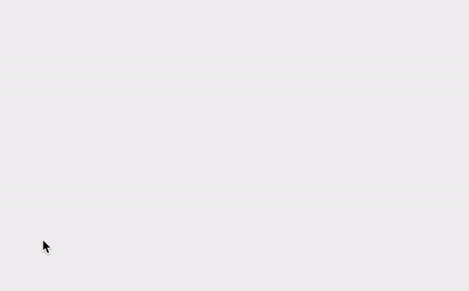
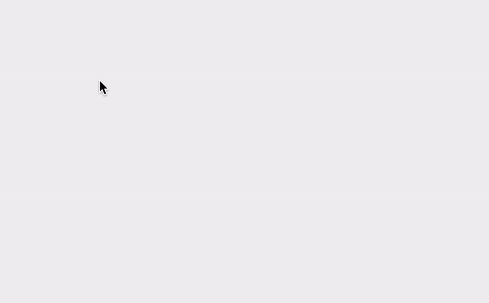

In this post, I'd like to show you how you can interactively create custom paths with the mouse in p5js. This can be handy if you are building a design tool for yourself or others. It will serve as a basic structure for more complex interactions. If you are not familiar with [the p5js library](https://p5js.org), you should still be able to apply the same logic to other JavaScript libraries because the way a path works in Canvas libraries are pretty much the same or very similar. 

## Paths in p5js

A path is made up of points, and is a basic building block of vector graphics. Think of it as Adobe Illustrator's Pen tool. You can create a path only using a straight line, or more often than not, we create paths with bezier curves.

Here is how you can draw a path that is made up of straight line segments.

```js
beginShape()
vertex(10, 10)
vertex(100, 10)
vertex(50, 80)
// ...add more vertices...
endShape()
```

If you need a curve, you have a few options. `quadraticVertex()` will give you a single control point so it is easy to use but will be difficult to fit complex shapes. `curveVertex()` and `bezierVertex()` each has two control points, which gives you more flexibility. Bezier curves are more difficult to use, and will require some experience before using them fluently. I usually use `curveVertex()` for simple interactive drawing applications because I cannot assume potential users' experience. I can also just focus on drawing and it will create a very smooth curve. Here are some tips for using `curveVertex()` You need at least four vertices to see the curve on screen because first and last vertex are used as control points. One easy trick to draw smooth and continuous curve is just to repeat the first and last vertex as below:

```js
beginShape()
curveVertex(100, 100) // repeat first vertex
curveVertex(100, 100)
curveVertex(300, 50)
curveVertex(300, 350)
curveVertex(100, 300)
curveVertex(100, 300) // repeat last vertex
endShape()
```

## Let's Make It Interactive

Let's make the drawing interactive so users can just use their mouse to draw a curve. For this, we will use three mouse event handlers - `mousePressed()`, `mouseDragged()` and `mouseReleased()`. Here is how this will work: First, when the mouse is pressed, we create an empty path. For dragging events, we add new vertex at mouse location. This will go on as long as the user keeps the mouse pressed and continues to drag.

I am also going to use `p5.Vector` objects. If you are not familiar with the vector math, don't worry, I am only using it to group `(x, y)` together although there are a lot of things you can do if you understand the vector.

```js
let pts = []
let strokeCol

function setup() {
  createCanvas(800, 500);
  strokeCol = '#000'
}

function draw() {
  background(240);

  noFill()
  stroke(strokeCol)
  strokeWeight(20)
  beginShape()
  for (let i = 0; i < pts.length; i++) {
    const pt = pts[i]
    if (i === 0) curveVertex(pt.x, pt.y) // repeat first vertex
    curveVertex(pt.x, pt.y)
    if (i === pts.length - 1) curveVertex(pt.x, pt.y) // repeat last vertex
  }
  endShape()
}

function mousePressed() {
  pts = []
  pts.push(new p5.Vector(mouseX, mouseY))
  strokeCol = color(random(255), random(255), random(255))
}

function mouseDragged() {
  pts.push(new p5.Vector(mouseX, mouseY))
}
```




## Make It Better

This is a pretty good start, I think, but it has a couple issues. One very obvious issue is that we can only store and draw a single path at a time. That is because we have only one array to store the points. To solve this issue, I will create a class to store all the points as well as other data instead of using a simple array. Another issue is that sometimes, I see there is a strange artifact where the path looks broken. This is because we are adding a new point for every mouse drag and sometime the two points are too close to each other, and also because of that, the path does not look very smooth.

Let's tackle these issues one by one. In the code below, I create a class to represent any path. It has `pts` array to store all the point coordinates (in this case, I use `p5.Vector` objects), and has a field called `strokeCol` so I can also control the stroke color.

move parts of the code from main sketch to class.

```js
class Path {
  constructor() {
    this.pts = []
    this.strokeCol = color(random(255), random(255), random(255))
  }

  addPoint(x, y) {
    this.pts.push(new p5.Vector(x, y))
  }

  display() {
    stroke(this.strokeCol)
    beginShape()
    for (let i = 0; i < this.pts.length; i++) {
      const pt = this.pts[i]
      if (i === 0) curveVertex(pt.x, pt.y)
      curveVertex(pt.x, pt.y)
      if (i === this.pts.length - 1) curveVertex(pt.x, pt.y)
    }
    endShape()
  }
}
```

And below is the main sketch code that uses `Path` objects. `paths` array stores multiple `Path` object, and `path` object represent the current path that we are working on.

```js
let paths = []
let path

function setup() {
  createCanvas(800, 500);
}

function draw() {
  background(240);

  noFill()
  strokeWeight(20)
  for (let j = 0; j < paths.length; j++) {
    const path = paths[j]
    path.display()
  }
}

function mousePressed() {
  path = new Path() // reset path so we can draw another one.
  path.addPoint(mouseX, mouseY)
}

function mouseDragged() {
  path.addPoint(mouseX, mouseY)
}

function mouseReleased() {
  paths.push(path) // add newly created path to paths array
}
```

Now, onto that weird artifacts. How can we limit the number of points added to the path while following the mouse movement? I decided to calculate the distance between the last point and the current mouse location and only if that distance is over the set threshold, then add a new point. This minimum distance requirement will make the path smoother and keep it from having too many points. I set it to 20 pixels but you can play with this value.

We already have a clear class structure, so it is easy to find where we need to add the new code for calculating the minimum distance - `mouseDragged()` function because that's where we add a new point. You can, alternatively, add the same code into `addPoint()` method in the `Path` class, but I decided to keep the method as generic as possible.

```js
function mouseDragged() {
  const lastPt = path.pts[path.pts.length - 1]
  const d = dist(mouseX, mouseY, lastPt.x, lastPt.y)
  if (d > 20) {
    path.addPoint(mouseX, mouseY)
  }
}
```

Finally, let's add a function so we can see the path as it is being drawn again.

```js
// call this function inside draw()
function previewPath(path) {
  // preview current path
  if (path) {
    stroke(path.strokeCol)
    beginShape()
    for (let i = 0; i < path.pts.length; i++) {
      const pt = path.pts[i]
      if (i === 0) curveVertex(pt.x, pt.y)
      curveVertex(pt.x, pt.y)
      if (i === path.pts.length - 1) curveVertex(pt.x, pt.y)
    }
    endShape()
  }
}
```


## What next

There are many things you can do by building upon this basic code. I have a few suggestions for you - add `strokeWeight` as a class property so that it is different for each path. Add additional keyboard interactions to control different parameters. You can also look at HTML5 Canvas [Path2D API](https://developer.mozilla.org/en-US/docs/Web/API/Path2D) if you don't want to use any libraries, but it is marked as experimental, so you will need to check the browser compatibility.

