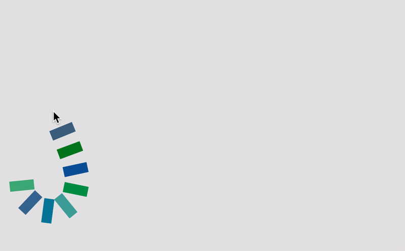
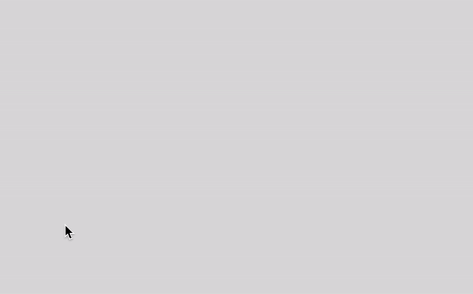
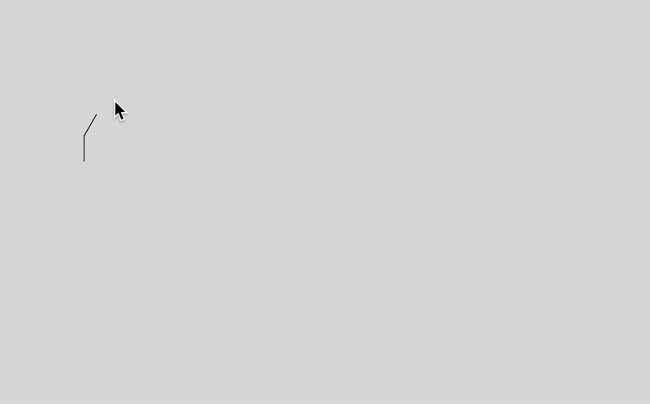
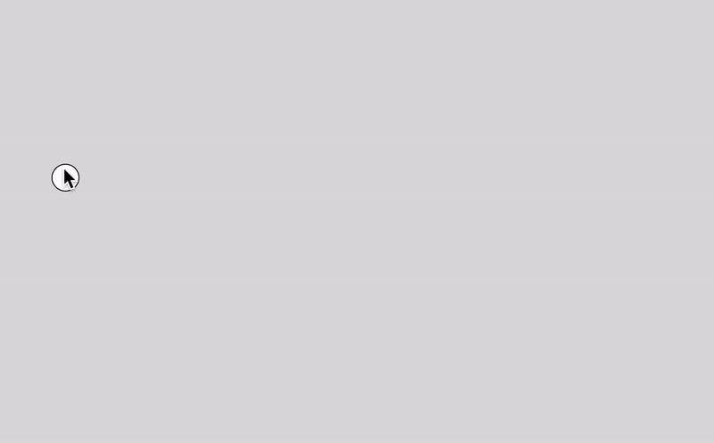
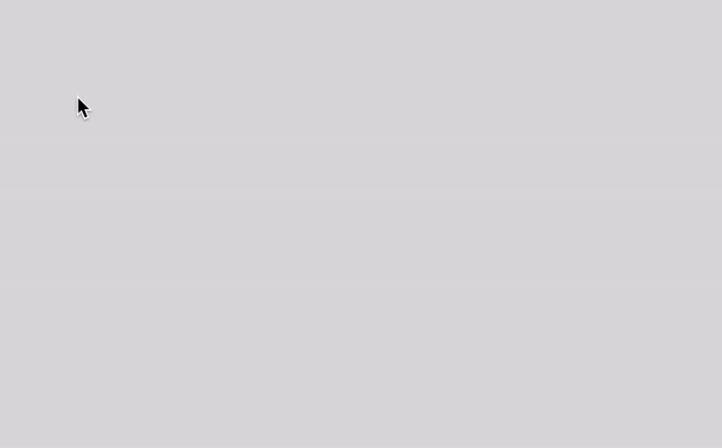
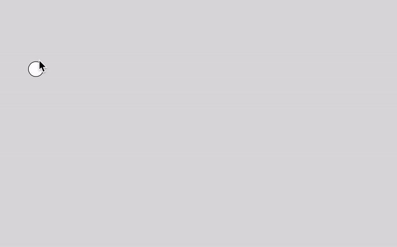
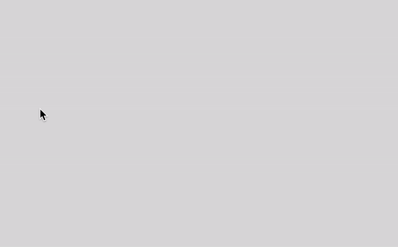

In [the last post](/blog/vector-boolean-ops-with-html5-canvas/), I talked about how you can draw a custom path using `curveVertex()` function in p5js. The question now is what if I do not want to use a continuous line, but instead, I want to use custom *shapes* as my brush? You know in Photoshop, there are hundreds of different kinds of brushes. 

*Note: This post's content is heavily inspired by [a paper.js tutorial](http://paperjs.org/tutorials/interaction/working-with-mouse-vectors/) although I did not look at the source code of the library for learning purpose.*

## Simplest Method

The easiest way to create a paint brush in p5js is to display a shape at mouse location every frame and not update background so the painted pixels will remain onscreen. The problem with this approach is that once it's painted, there is not much you can do. You can't animate, you can't edit the points. You will also see that if you move your mouse too slow or too fast, it either creates too many shapes or too little. In other words, you cannot control the density of brush strokes as demonstrated below:

```js
function setup() {
  createCanvas(800, 500)
  background(220)
}

function draw() {
  //
}

function mouseDragged() {
  ellipse(mouseX, mouseY, 50, 50)
}

function mouseReleased() {
  background(220)
}
```



## How Can We Do Better?

What we can do to make this better is to create a structure that saves all the points that are being drawn. Once we have the points stored in an array, we can access and edit them after they have been drawn. I wrote about how to do this in [the previous post](/blog/vector-boolean-ops-with-html5-canvas/), and this post will build upon that to now control the distance between each point, and also calculate the angle between each point. This will allow us to use many different custom brush shapes (ie. textured brushes). It's also great to learn more about the vectors as it's really useful, and I would say required, for any advanced computer graphics applications.

I will use the p5js library to explain the concept, but you should be able to use other Canvas libraries as well.


## The Base Class

Below is the base class that we will build upon. To briefly explain what it does, the `Path` class stores all its points in `this.pts` array, which we start as an empty array, but with `addPoint()` method, we will push a new point whenever the mouse is dragged. We use `p5.Vector` object as a data structure for a point because this will come in handy when we calculate distances and angles later. Note that we start our for loop index from 1, not 0, because we want to get both the previous and the next point location so that we can connect the two to draw a line segment. This works at a basic level, but it will add a lot of points very quickly and make our array too big for no good reason.

```js
class Path {
  constructor() {
    this.pts = [];
  }

  addPoint(x, y) {
    this.pts.push(new p5.Vector(x, y));
  }

  // shape of brush
  display() {
    for (let i = 1; i < this.pts.length; i++) {
      const prev = this.pts[i - 1];
      const next = this.pts[i];
      line(prev.x, prev.y, next.x, next.y);
    }
  }
}
```

## Check The Distance

What I did next was to check the distance between the last point and the current mouse location and if the distance is greater than the set distance, then we will push its location to `this.pts` array. Notice that I am using a static method `p5.Vector.dist()` so as not to change the original vector object itself, and it will return a new vector object.

```js
let path;

function setup() {
  createCanvas(800, 500);
  path = new Path();
}

function draw() {
  background(220);
  path.display();
}

function mousePressed() {
  path = new Path();
}

function mouseDragged() {
  path.addPoint(mouseX, mouseY);
}

class Path {
  constructor() {
    this.pts = [];
    this.size = 30
  }

  getLastPoint() {
    return this.pts[this.pts.length - 1];
  }

  addPoint(x, y) {
  	// if it's first point, just push and return.
    if (this.pts.length < 1) {
      this.pts.push(new p5.Vector(x, y));
      return;
    }

    const nextPt = new p5.Vector(x, y);
    let lastPt = this.getLastPoint();
    let d = p5.Vector.dist(nextPt, lastPt);

    if (d > this.size) {
      this.pts.push(new p5.Vector(x, y));
    }
  }

  display() {
    for (let i = 1; i < this.pts.length; i++) {
      const prev = this.pts[i - 1];
      const next = this.pts[i];
      line(prev.x, prev.y, next.x, next.y);
    }
  }
}
```



It looks pretty good, so at this point, I decided to try an ellipse for my brush shape. As you can see below, it works pretty fine when I move my mouse slowly, but if I move it quickly, there is a lot of gap between ellipses. That's not good.



## Fill In The Gap

My first thought for solving the problem was to use `lerp()`. The idea is that if the distance between the two points are bigger than the size of the ellipse, then, I will first calculate how many more points are needed to fill in the gap, and using a for loop, I will push that many new points to the pts array.

```js
addPoint(x, y) {
  // if it's first point, just push and return.
  if (this.pts.length < 1) {
    this.pts.push(new p5.Vector(x, y));
    return;
  }

  const nextPt = new p5.Vector(x, y);
  let lastPt = this.getLastPoint();
  let d = p5.Vector.dist(nextPt, lastPt);

  if (d >= this.size) {
    const numPointsToAdd = floor(d / this.size)
    for (let i = 0; i < numPointsToAdd; i++) {
      const t = i / numPointsToAdd
      const pt = p5.Vector.lerp(lastPt, nextPt, t)
      this.pts.push(pt)
    }
  }
}
```



It worked better than the last solution but there are still little gaps between ellipses. I think it is because of rounding errors in the divisions. So, instead, I decided to try subtraction to consume the distance until there is no pixel left. For this I used a while loop and updated the distance each time. Notice that I am normalizing the `diff` vector. When you normalize a vector, it becomes a unit vector with the magnitude of 1. Then you can multiply with any number to scale the vector while keeping the same direction or heading. Again, I am using the static versions of `sub()` and `add()` to get a new vector returned.

```js
addPoint(x, y) {
  // if it's first point, just push and return.
  if (this.pts.length < 1) {
    this.pts.push(new p5.Vector(x, y));
    return;
  }

  const nextPt = new p5.Vector(x, y);
  let lastPt = this.getLastPoint();
  let d = p5.Vector.dist(nextPt, lastPt);

  while (d > this.size) {
    const diff = p5.Vector.sub(nextPt, lastPt);
    diff.normalize();
    diff.mult(this.size);
    this.pts.push(p5.Vector.add(lastPt, diff));
    lastPt = this.getLastPoint();
    d -= this.size;
  }
}
```



And it worked perfectly this time! I suggest that you play with `this.size` value or add a method to animate the points. The possibilities are endless. 

## Rotate The Vectors

So far, we have been using the ellipse as a brush shape but let's change the brush shape to a rectangle.

```js
display() {
  rectMode(CENTER)
  for (let i = 1; i < this.pts.length; i++) {
    const prev = this.pts[i - 1];
    const next = this.pts[i];
    // line(prev.x, prev.y, next.x, next.y);
    rect(next.x, next.y, this.size, this.size)
  }
}
```

You will notice that the brush strokes are not quite right. That's because the rectangle does not rotate as our path changes its direction. As a last step, I would like to show you how to implement the rotation. Here is the updated `Path` class:

```js
class Path {
  constructor() {
    this.pts = [];
    this.angles = [];
    this.size = 20;
  }

  get lastPt() {
    return this.pts[this.pts.length - 1];
  }

  addPoint(x, y) {
    if (this.pts.length < 1) {
      this.pts.push(new p5.Vector(x, y));
      return;
    }

    const nextPt = new p5.Vector(x, y);
    let d = p5.Vector.dist(nextPt, this.lastPt);

    while (d > this.size) {
      const diff = p5.Vector.sub(nextPt, this.lastPt);
      diff.normalize();
      diff.mult(this.size);
      this.pts.push(p5.Vector.add(this.lastPt, diff));
      this.angles.push(diff.heading());
      d -= this.size;
    }
  }

  display() {
    rectMode(CENTER);
    for (let i = 1; i < this.pts.length; i++) {
      const prev = this.pts[i - 1];
      const next = this.pts[i];
      const diff = p5.Vector.sub(next, prev);
      diff.mult(0.5);
      push();
      translate(prev.x + diff.x, prev.y + diff.y);
      rotate(this.angles[i - 1]);
      rect(0, 0, this.size * 0.5, this.size);
      pop();
    }
  }
}
```

What's changed is that I added a new property called `this.angles` to store angles between each point. Every time we push a new point, we also push a new angle by getting the heading of the difference vector in `addPoint()` method. In `display()` method, instead of rotating and drawing the rectangle at the point location, I find halfway between the previous and next points. This is because it's hard to get the angle for the last point as there is no *next* point at the end. Another minor change I made is to change `getLastPoint()` method to a getter `lastPt()` so I can use it like a variable.




## Wrap Up

This is just the beginning of many things you can do with vector paths. I actually had a lot of fun writing this post and playing with the codes. I might come back with another post on the vector path. Do you have any interesting ideas in mind?