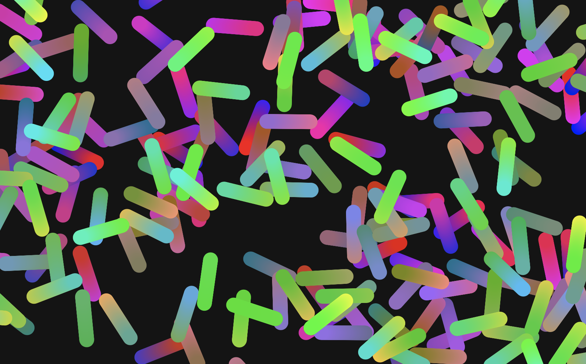
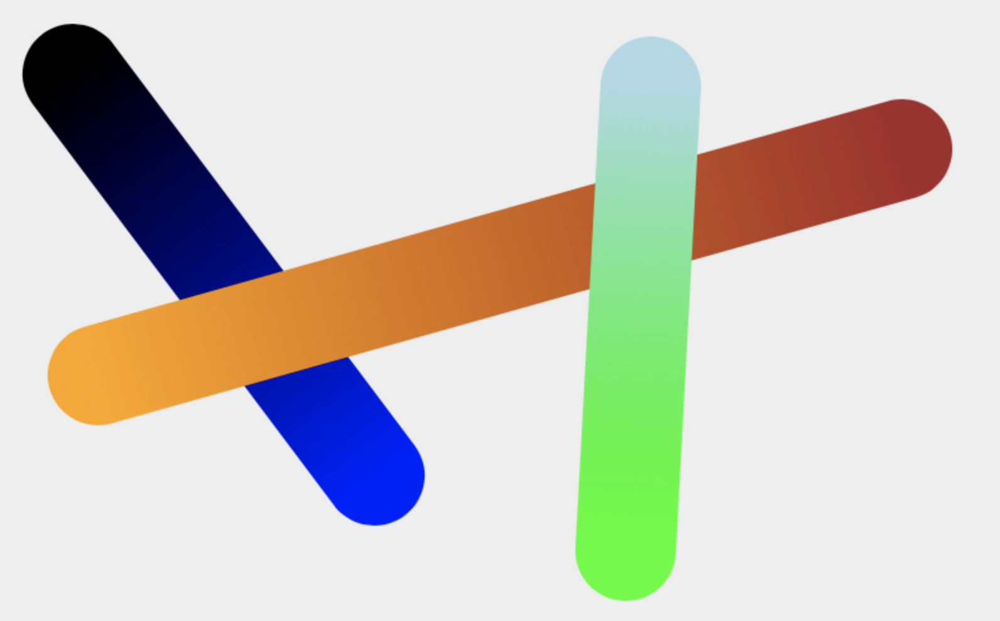
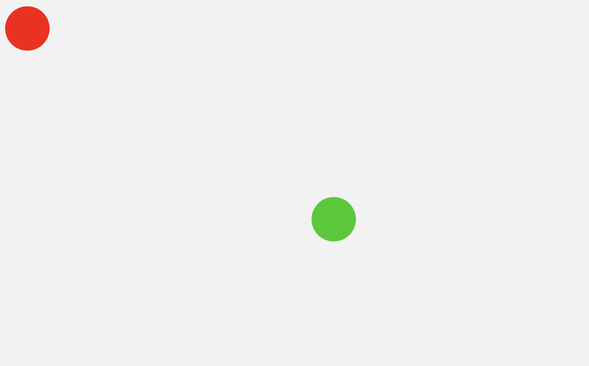
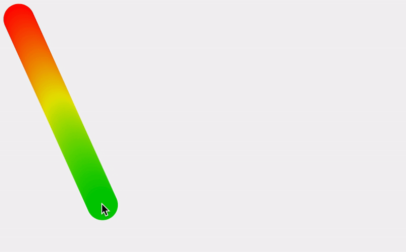
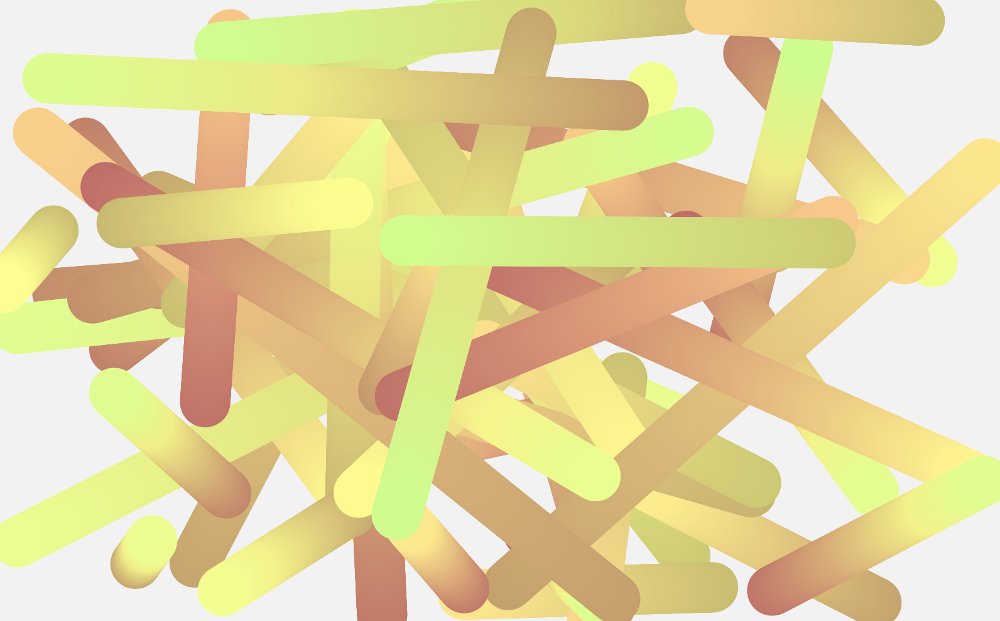
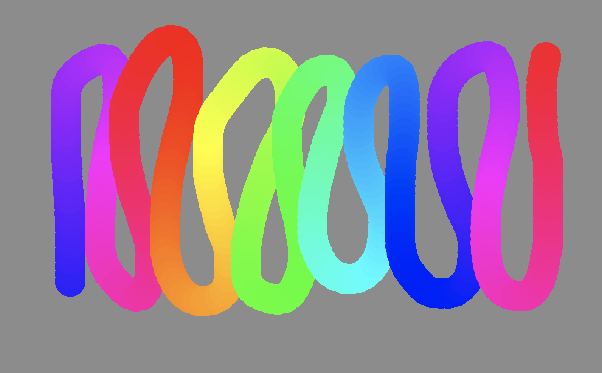

In this post, I want to talk about how to create a gradient line in p5js. But first, let's look at how we can do this without using any libraries with HTML5 Canvas API. 


## Canvas Way

Conveniently for us, there is a method called `createLinearGradient()`. The idea is to set the start and end of the gradient position the same as the line itself. 

```js
// assuming you already have a <canvas> in your html.

const canvas = document.querySelector("#canvas");
const ctx = canvas.getContext("2d");
canvas.width = 800
canvas.height = 500
ctx.lineWidth = 80;
ctx.lineCap = 'round'

gradientLine(ctx, 60, 60, 300, 380, 'black', 'blue')
gradientLine(ctx, 720, 120, 80, 300, 'brown', 'orange')
gradientLine(ctx, 520, 70, 500, 440, 'lightblue', 'lime')

function gradientLine(ctx, x1, y1, x2, y2, c1, c2) {
  const gradient = ctx.createLinearGradient(x1, y1, x2, y2);
  gradient.addColorStop(0, c1);
  gradient.addColorStop(1, c2);
  ctx.strokeStyle = gradient;

  ctx.beginPath();
  ctx.moveTo(x1, y1);
  ctx.lineTo(x2, y2);
  ctx.stroke();
}
```



This Canvas solution might be just what you need, but p5js does not have this part of the Canvas API implemented so if you want to try this with p5js, use the global variable `drawingContext` like this:

```js
gradientLine(drawingContext, 60, 60, 90, 90, 'black', 'blue')
```

## Using A Loop

Let's look at another way of creating a gradient. In fact, there are multiple ways of doing this. My solution in this post is similar to [the linear gradient example](https://p5js.org/examples/color-linear-gradient.html) where we draw multiple shapes in a loop to make it feel as if it is a single continuous line. This, I think, is the simplest and easiest one to implement. 

Other methods of creating gradients that I can think of are:

- per-vertex coloring of a path
- use an image texture in WebGL mode
- use a WebGL shader

I do want to explore these other options when I get a chance but for now, let's keep things simple and look at how we can create a gradient using a for loop and linear interpolation.

## Fill The Gap

This is where we start. We just define two end points.

```js
function setup() {
  createCanvas(800, 500);
  colorMode(HSB, 360, 100, 100)
  noStroke()
}

function draw() {
  background(0, 0, 95);

  const x1 = 40
  const y1 = 40
  const x2 = mouseX
  const y2 = mouseY

  fill(0, 100, 100)
  ellipse(x1, y1, 60, 60)

  fill(120, 100, 80)
  ellipse(x2, y2, 60, 60)
}
```



I have two circles here and I want to create a series of circles to fill the space between them as well as gradually change the color. Adding an arbitrary number of circles will not cut as it may still leave some empty space between circles. Instead, we can calculate the distance between the two initial circles and add new circles and place them dense enough to make it look like it is a continuous line.

```js
function draw() {
  background(0, 0, 95);

  const x1 = 40
  const y1 = 40
  const x2 = mouseX
  const y2 = mouseY
  
  const c1 = color(0, 100, 100)
  const c2 = color(120, 100, 80)

  fill(c1)
  ellipse(x1, y1, 60, 60)

  fill(c2)
  ellipse(x2, y2, 60, 60)
  
  const d = dist(x1, y1, x2, y2)
  for (let i = 0; i < d; i++) {
    const step = map(i, 0, d, 0, 1)
    const x = lerp(x1, x2, step)
    const y = lerp(y1, y2, step)
    
    const c = lerpColor(c1, c2, step)
    fill(c)
    ellipse(x, y, 60, 60)
  }
}
```

The important thing to look at here is the for loop. It goes through the whole distance and at each iteration, `i` is incremented by one (a single pixel) so that we can add a new circle every pixel between the start and end position. To calculate the intermediate `(x, y)` position value, we use `lerp()` or linear interpolation. The linear interpolation finds a value between the two end values - `(x1, x2)` and `(y1, y2)` - by the amount we set as the third argument. That amount goes between 0 and 1. That is why I am mapping `i` that originally goes between `0` and `d` to be within the range of `0` and `1`. We also interpolate the two colors with a very helpful p5js method `lerpColor()`. The result is as below:



Let's refactor the code and make this into a reusable function.

```js
function draw() {
  background(0, 0, 95);

  gradientLine(50, 50, mouseX, mouseY, color(0, 0, 0), color(0, 100, 100), 60)
}

function gradientLine(x1, y1, x2, y2, c1, c2, sz) {
  const d = dist(x1, y1, x2, y2)
  for (let i = 0; i < d; i++) {
    const step = map(i, 0, d, 0, 1)
    const x = lerp(x1, x2, step)
    const y = lerp(y1, y2, step)
    const c = lerpColor(c1, c2, step)
    fill(c)
    ellipse(x, y, sz, sz)
  }
}
```

Now, it is a reusable function meaning we can create multiple gradient lines easily.

```js
// in setup()
const num = 50
for (let i = 0; i < num; i++) {
  gradientLine(random(width), random(height), random(width), random(height), color(random(60), 50, 80), color(random(30, 90), 50, 100), 40)
}
```




## Gradient Brush

As the last step, I want to turn this into a gradient brush, with which you can interactively paint. To do this, I will borrow the `Path` class from my previous post, [Fixed Distance Brush In p5js](/blog/fixed-distance-brush-in-p5js/), and make some changes.

Let me first explain what changes I made. I created a few properties to keep track of the colors at each point of the path - `this.hue` and `this.hues`. Just like how we used the `step` variable in the examples above to update the color throughout the gradient, we use `this.hue` to set and update the current color being used. And every time a new point is added to the array `this.pts`, I am also adding a new color to the `this.hues` array. 

```js
this.hue = (this.hue + 1) % 360;
```

The above expression is to make sure the hue value stays within the range between 0 and 360 and have a seamless transition.

I also added `this.spacing`. Ideally, we would add a new circle for every pixel of the distance, but I noticed that the performance drops significantly. The spacing value of `10` seems like a good place to start, but you should play with the value yourself. 

Also, I removed the part that calculates the angle as I am using a circle brush and do not need the angle and simplified the `display()` method.

This version of the sketch is not quite optimized, and if you hold the mouse for too long, or use a very large brush, the frame rate will drop. Anyway, here is the final sketch with the updated `Path` class. I hope this is useful to you!



```js
let path

function setup() {
  createCanvas(800, 500);
  colorMode(HSB, 360, 100, 100)
  noStroke()

  background(0, 0, 55);

  path = new Path()
}

function draw() {
  path.display()
}

function mousePressed() {
  path = new Path()
}

function mouseDragged() {
  path.addPoint(mouseX, mouseY);
}

class Path {
  constructor() {
    this.pts = [];
    this.size = 40; // size of brush
    this.spacing = 10; // spacing between points; lower value gives you smoother path, but frame rate will drop
    this.hue = random(360) // start value
    this.hues = [] // keep track of the hues for each point
  }

  get lastPt() {
    return this.pts[this.pts.length - 1];
  }

  addPoint(x, y) {
    if (this.pts.length < 1) {
      this.pts.push(new p5.Vector(x, y));
      this.hues.push(this.hue)
      return;
    }

    const nextPt = new p5.Vector(x, y);
    let d = p5.Vector.dist(nextPt, this.lastPt);

    while (d > this.spacing) {
      const diff = p5.Vector.sub(nextPt, this.lastPt);
      diff.normalize();
      diff.mult(this.spacing)
      this.pts.push(p5.Vector.add(this.lastPt, diff));
      d -= this.spacing;
      this.hue = (this.hue + 1) % 360; // for each new point, update the hue
      this.hues.push(this.hue)
    }
  }

  display() {
    noStroke()
    for (let i = 0; i < this.pts.length; i++) {
      const p = this.pts[i];
      fill(this.hues[i], 100, 100)
      ellipse(p.x, p.y, this.size, this.size);
    }
  }
}
```