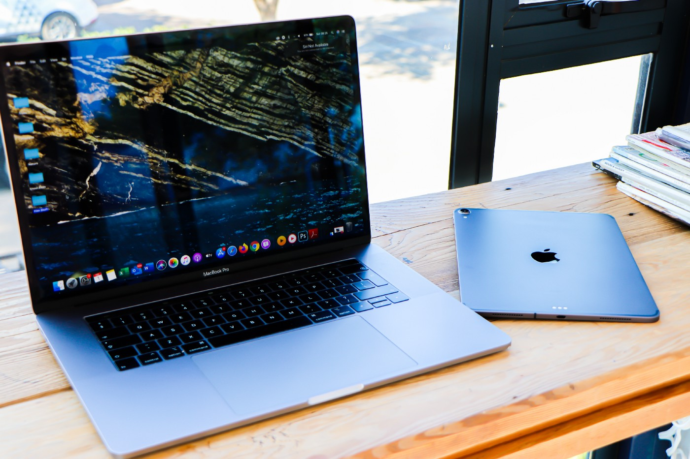

_This is based on my experience and it may not work for your machine. Please use it at your own risk. I cannot take responsibility for any harm done to your computer._

I have been very happy with my Conda virtual environment setup to do machine learning experiments locally, but as you probably already know, you cannot utilize AMD GPUs on Mac with Tensorflow. Most, if not all, ML frameworks only supports Nvidia GPUs. I have used PlaidML to get around this issue. When it worked, it worked great, but when it didn’t, it just didn’t. Then, I saw there was [a Github repo](https://github.com/apple/tensorflow_macos) that experimentally supported Mac GPU with Tensorflow, and only recently realized that now Apple started to support it more officially.

In the link above, you will find the official instructions from Apple on how to install python packages to utilize your GPUs for both M1 and Intel-based Macs. You will also find [many forum posts](https://developer.apple.com/forums/tags/tensorflow-metal) on various issues people have encountered. In this post, I just want to share how I was able to install all the necessary softwares and test it on Jupyter notebook. But I don’t think my short post will cover every use case and every issue, so if you find something that I miss, please let me know, and I will try to update the post accordingly.

I do not have M1-based Mac, so I will focus on installing on Intel-based 16-inch Macbook Pro model with AMD GPU that I have.

## Python 3.8 — The only version that is supported

Before you follow [the official installation instructions](https://developer.apple.com/metal/tensorflow-plugin/), you need to have python 3.8. That’s the only version that Apple’s plugin supports for Intel-based Macs at the time of writing.

First, let’s open Terminal app. I am using a Conda environment by default, so I had to first deactivate it. I haven’t found a way to install the plugins using Conda yet.

Run the command below only if you are already using Conda.

```bash
$ conda deactivate
```

Then, check the current active python version by:

```bash
$ python --version
```

It should print python 3.8.x, and if it does, you can skip this part. But it’s more likely that it will print 2.x. If so, you will either have to newly install python 3.8 or switch to 3.8 that you already have on your system.

## Newly install python 3.8

In terms of newly installing python 3.8, I am using brew as my main Mac package manager. Brew makes it very easy and fast to manage all kinds of softwares on your Mac. If you are not afraid of using Terminal commands, I highly recommend that you try it. Check the Brew website on how to install. The command below expects that you have already installed Brew.

```bash
$ brew install python@3.8
```

## Switch to python 3.8

Now let’s list all the python versions you have installed through Brew:

```bash
$ brew list --formula | grep python
```

When I run the command above, I can see that I have both python 3.8 and 3.9. As I have said above, Apple Tensorflow plugins for Intel-based Macs only works with python 3.8. To use the python 3.8 as default, I had to run the commands below one at a time. You will have to restart the Terminal after running the commands.

```bash
$ brew unlink python@3.9
$ brew unlink python@3.8
$ brew link --force python@3.8
```

The steps below is a bit murky to me because I have already been using Brew and Python in different contexts, and have been playing around with them for some time. So I am not entirely sure what the setup will look like to a fresh machine. My apologies if this part is not clear to you. I will do my best, though.

Let’s restart the Terminal app and check the python version again. In fact, there are two different commands for checking the current python version — pythonand python3 Run the commands one at a time.

```bash
$ python --version
$ python3 --version
```

Do they all list as 3.8? Then, you are good to go, but if python --version shows you something other, then follow the steps below.

First, let’s check all the versions that your system has:

```bash
$ ls -l /usr/local/bin/python*
```

In my case, I can see that I have 3.8 at/usr/local/bin/python3.8 . So I will create a Symlink so that when I run `python` command, I am actually calling `python3`.

```bash
$ ln -s -f /usr/local/bin/python3.8 /usr/local/bin/python
```

Now, let’s check the python version one more time. It should print python 3.8 this time.

```bash
$ python --version
$ python3 --version
```

If so, now we are finally ready to follow the Apple instructions!

## Follow Apple Instructions

From [the Apple instructions page](https://developer.apple.com/metal/tensorflow-plugin/), run the first command:

```bash
$ python3 -m venv ~/tensorflow-metal
```

This will create a virtual environment at your user directory. Again, I have not found a way to do this with Conda yet.

Now, run the second command:

```bash
$ source ~/tensorflow-metal/bin/activate
```

This will activate the python3 (3.8) virtual environment. You will want to run this command every time you want to use this virtual environment. Just to be on the safe side, let’s check the python version again. Hopefully, it is still python 3.8!

```bash
$ python -V
```

Now, on to the third and last command:

```bash
$ python -m pip install -U pip
```

`pip` will make it easy to install any python packages. The Step 2 and 3 below will install two different plugins. I saw from various posts that people ran into issues at these steps. In my case, when I made sure that I was using python 3.8, I was able to install them successfully. Run the commands below one at a time:

```bash
$ python -m pip install tensorflow-macos
$ python -m pip install tensorflow-metal
```

## Install Additional Packages

This may be optional but because I like to work with Jupyter notebooks, I installed a few more packages:

```bash
$ python -m pip install jupyter notebook jupyterlab
```

Once everything is ready, in the same Terminal window, let’s run the Jupyter Lab by:

```bash
$ jupyter lab
```

This will automatically open up Jupyter Lab in a new browser tab.

## Check GPU Device

The last step will be to see whether Tensorflow can now see the AMD GPU device. Run the following python code in your notebook cell:

```python
import tensorflow as tf
devices = tf.config.list_physical_devices()
print(devices)
```

I can now see both CPU and GPU listed as physical devices, which is very exciting! I have not really done any performance testing yet so can’t say anything in that regard.

I hope you find my post useful, and I will leave a few useful links below:

- https://dev.to/malwarebo/how-to-set-python3-as-a-default-python-version-on-mac-4jjf
- https://developer.apple.com/metal/tensorflow-plugin/
- https://developer.apple.com/forums/tags/tensorflow-metal