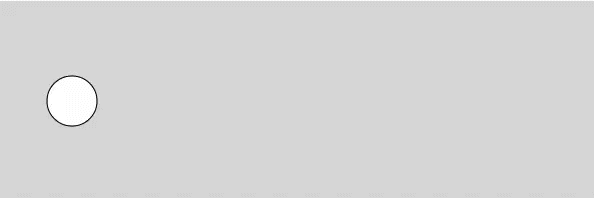
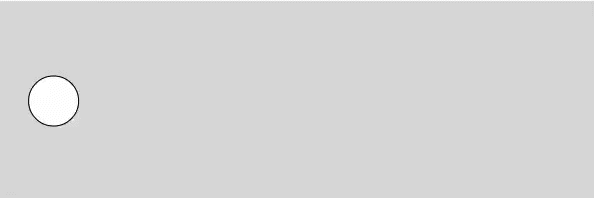
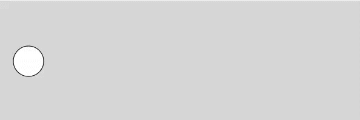

Easing makes animation look more natural and professional. If you use After Effects, you are probably familiar with Graph Editor and adjusting curve shapes to apply easing. In CSS, you can very easily apply multiple types of easing. How about JavaScript? You can simply install and use some of the popular animation libraries. 

But in this post, instead of just showing you how to use these libraries, I want to show you how to apply your own easing from scratch without using any library. Well, except for the [p5js](https://p5js.org) library we will use to create Canvas-based graphics. But that's not mandatory. You can simply use Canvas API if you want. 

We will start from a very basic linear motion to all kinds of easing animation. There are several ways to create convincing animation. You can go with physics-based animation where you define different forces such as gravity, friction, etc. to simulate real world behavior, but in this post I will only focus on using simple linear interpolation and easing curves.

## Linear Motion
Let's first set up our sketch with a few variables. We will animate the ellipse from the left to the right side of the screen. Here is the basic setup:

```js
let x, y

function setup() {
  createCanvas(600, 200);
  
  x = 50
  y = height/2
}

function draw() {
  background(220);
  
  ellipse(x, y, 50, 50)
}
```

The most straight forward way to move it is to just increment `x` each frame like below:
```js
function draw() {
  background(220);
  
  // update animation
  x += 5
  // reset x
  if (x > width - 50) {
    x = 50
  }
  
  ellipse(x, y, 50, 50)
}
```


Here, `25` is the speed of the movement. The circle moves 5 pixels each frame, and when it reaches the end, it will jump back to the beginning position. If you want to make it move faster, simply increase the speed by changing `5` to `10`, for example.
```js
x += 10 // move 10 px per frame
```

This is pretty cool, but it is a linear motion and looks very mechanical and dull. So let's move on.

## Simple Method (but not the best)
Here is a chop I learned early in my creative coding practice. A quick way to apply easing is by self-updating a value little by little every frame with `lerp()`.

```js
x = lerp(x, destination, amount)
```

We update `x` each frame between its current value and the destination by an amount between 0 and 1.

```js
function draw() {
  background(220);
  
  // update animation
  x  = lerp(x, width - 50, 0.05)
  
  // reset x
  if (x >= width - 50) {
    x = 50
  }
  
  ellipse(x, y, 50, 50)
}
```



This method is great in that it is very simple to set up and it gets the job done most of the time. In fact, this is the method that I used in [my post on animating text a year ago](/blog/animate-word-by-word-in-p5js/), but this is not really how the `lerp` or linear interpolation function is supposed to be used because it's not really linear, and there are other problems, too.

First, you might have already noticed that it takes very long time for `x` to reset back to `50`, if at all. Well, mathematically, it will never reach the end value, which in our case is `width - 50` because it is always moving 5 percent of the remaining distance. If it resets after some time, that's probably due to the float point error in JavaScript.

Also, you don't really have much control other than adjusting the third parameter - the amount of interpolation. So, if you want to try different types of easing, it will be very difficult, if not impossible. I mean, it's a quick and dirty way of apply easing without writing extra lines of code, so I think it has its uses, but we can do better and that's the whole point of this post.

## Keep Linear Interpolation Linear
First of all, let's change our frame-based animation to time-based, so that our animation duration is consistent no matter what frame rate is being used. We will introduce `deltaTime` variable. This is what p5js library provides to us, but creating one for yourself is also relatively easy. I have explained the basics in [my other post](/blog/p5js-animate-with-deltatime/). Please check it out if you want to learn more. I have updated the code so that it uses `deltaTime` instead of relying on frame count:

```js
function draw() {
  background(220);
  
  // deltaTime is in millis, so convert to sec
  const dt = deltaTime * 0.001
  
  // update animation
  x += dt * 300
  
  // reset x
  if (x > width - 50) {
    x = 50
  }
  
  ellipse(x, y, 50, 50)
}
```

In the code above, `deltaTime` variable returns you the time it takes between last frame and current frame in milliseconds, but I prefer to use seconds as my unit, so I am multiplying `0.001`. This is just optional. One other important change is how we increment `x`.

```js
x += dt * 300
```

Here, the number `300` is the speed of `x` changing. It is currently moving 300 pixels per second. So, now we are back to linear motion, but the set up is different that we are now using time-based animation, and it is independent from the frame rate.

## Apply Easing Functions
Instead of directly interpolating `x` like early examples, we will introduce `t` that will be used as the interpolation amount, the third parameter in the `lerp` function. We introduce `startX` and `endX` variables. This way, we maintain that the lerp will indeed be linear. We also introduce two more variables, `elapsed` to keep track of time elapsed in seconds, and `duration` to define the total duration of our animation. By `t = elapsed/duration`, we make sure `t` will move from 0 to 1 for the duration we defined.

```js
let x, y
let startX
let endX

let elapsed
let duration

function setup() {
  createCanvas(600, 200);
  
  x = 50
  y = height/2
  startX = 50
  endX = width - 50
  
  elapsed = 0 // in seconds
  duration = 1.2 // in seconds
}

function draw() {
  background(220);
  
  const dt = deltaTime * 0.001
    
  // update time and animation
  elapsed += dt
  const t = elapsed/duration
  x = lerp(startX, endX, t)
  
  ellipse(x, y, 50, 50)
  
  // reset time
  if (elapsed >= duration) {
    elapsed = 0
    x = startX
  }
}
```

We have now time-based linear animation working with `lerp`. The next thing we need to do is to decide what happens for the duration. This is what we call *spacing* in animation terms, and that's what easing functions are for. Here is an example of such easing functions:

```js
function easeInOutSine(x) {
  return -(cos(PI * x) - 1) / 2;
}
```

The function above smoothes out the change of the value `x` at the beginning and near the end. I took this function from https://easings.net. This website is a great resource that provides you with all kinds of easing functions, so do check it out.

Now, when we interpolate the `x` value, instead of using `t` as is, which is linear, we will apply easing first and then interpolate the `x`. This way, we keep `t` linear, but the change in `x` will have easing applied. Again, `t` always goes from 0 to 1 even after applying easing. What matters now is what happens in-between.

```js
x = lerp(startX, endX, easeInOutSine(t))
```

The full code is below:

```js
let x, y
let startX
let endX

let elapsed
let duration

function setup() {
  createCanvas(600, 200);
  
  x = 50
  y = height/2
  startX = 50
  endX = width - 50
  
  elapsed = 0 // in seconds
  duration = 1.2 // in seconds
}

function draw() {
  background(220);
  
  const dt = deltaTime * 0.001
    
  // update time and animation
  elapsed += dt
  const t = elapsed/duration
  x = lerp(startX, endX, easeInOutSine(t))
  
  ellipse(x, y, 50, 50)
  
  // reset time
  if (elapsed >= duration) {
    elapsed = 0
    x = startX
  }
}

function easeInOutSine(x) {
  return -(cos(PI * x) - 1) / 2;
}
```


We now have control over many asepect of our animation - the start value and end value we are animating, the total duration of the animation, as well as the type of easing we want to apply. So play with different duration, different start/end values, and find different easing functions. Here is a super fun bouncy easing I found from https://easings.net again. We don't have to tweak any of our code because this easing function also takes the same `x` as the only parameter:

```js
function easeOutBounce(x) {
  const n1 = 7.5625;
  const d1 = 2.75;

  if (x < 1 / d1) {
    return n1 * x * x;
  } else if (x < 2 / d1) {
    return n1 * (x -= 1.5 / d1) * x + 0.75;
  } else if (x < 2.5 / d1) {
    return n1 * (x -= 2.25 / d1) * x + 0.9375;
  } else {
    return n1 * (x -= 2.625 / d1) * x + 0.984375;
  }
}
```




## Robert Penner's Easing Equations
When you do research on easing functions, you may find the easing functions are described in different shapes, so-called "Penner Easing," such as this one that takes four parameters:

```js
function easeInOutCubic(t, b, c, d) {
  if ((t /= d / 2) < 1) return (c / 2) * t * t * t + b;
  return (c / 2) * ((t -= 2) * t * t + 2) + b;
}
```

The ingredients are the same. Here, `t` is elapsed time, `b` is start value, `c` is change in value, in our example, that wil be `endX - startX`, and lastly `d` is duration. We already have all the data, so let's rewrite our code for this new easing function.

```js
let x, y;
let startX;
let endX;

let elapsed;
let duration;

function setup() {
  createCanvas(600, 200);

  x = 50;
  y = height / 2;
  startX = 50;
  endX = width - 50;

  elapsed = 0; // in seconds
  duration = 1.2; // in seconds
}

function draw() {
  background(220);

  const dt = deltaTime * 0.001;

  // update time and animation
  elapsed += dt;
  x = easeInOutCubic(elapsed, startX, endX - startX, duration);

  ellipse(x, y, 50, 50);

  // reset time
  if (elapsed >= duration) {
    elapsed = 0;
    x = startX;
  }
}

// t: elapsed time
// b: start value
// c: change in value (end value - start value)
// d: duration
function easeInOutCubic(t, b, c, d) {
  if ((t /= d / 2) < 1) return (c / 2) * t * t * t + b;
  return (c / 2) * ((t -= 2) * t * t + 2) + b;
}
```



Now, it's just a matter of finding an easing equation that suits your need. As long as you can come up with an equation that goes from 0 to 1, you can also create your own easing function. A website tool like https://www.desmos.com/ will be useful.

Hope you have fun with easing, and follow me for more stories like this. I write about creative coding for artists and designers.

## References
The ideas described in this post was all from great people who shared their knowledge online. Here are some I learned a lot from:
- This is one of the most important reference out there, and what I based easing functions on: http://robertpenner.com/easing/
- I took easing functions from this website as well: https://easings.net
- If you want a deep dive in animation and manipulating time, check this out: https://acko.net/blog/animate-your-way-to-glory/
- If you have a fast moving object, it may go past the boundary you set. In that case, check this page on how to fix time step: https://gafferongames.com/post/fix_your_timestep/

