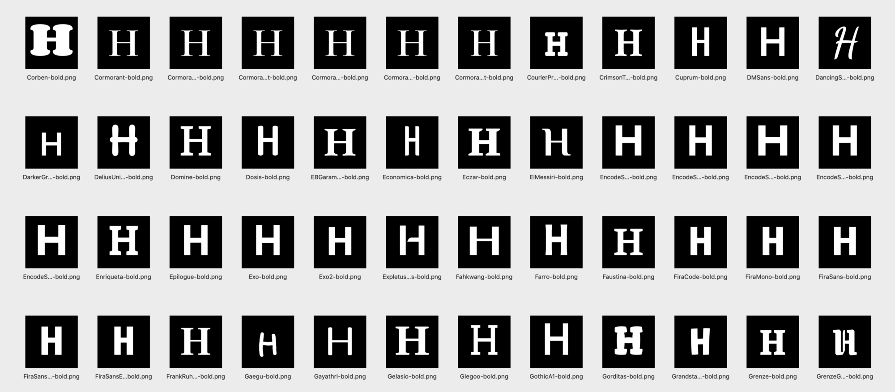
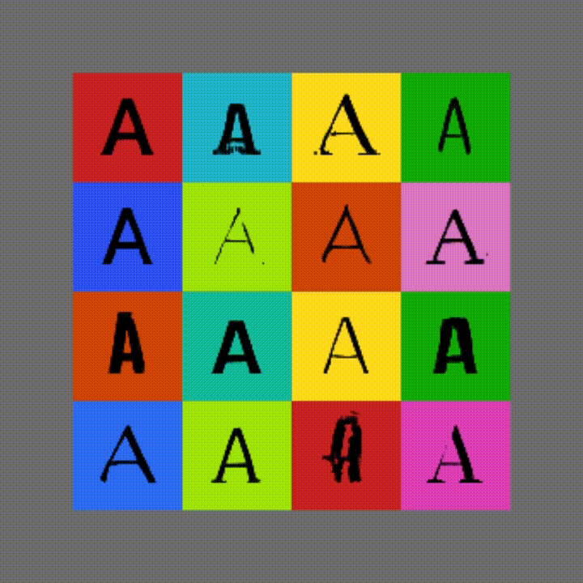
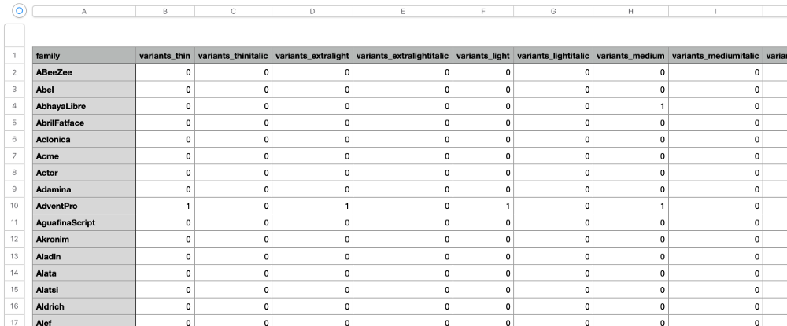

*Note: This is the first post of the two-part series where I will go over downloading Google Fonts and cleaning up the JSON annotations before we can filter fonts and generate PNG images. The link to the 2nd part is at the bottom.*

The first time I tried to learn machine learning a few years ago, I felt miserable. I had a hard time installing dependencies, let alone understanding any basic machine learning algorithms. Fast forward to 2020, with more time at home, I decided to give ML another try. This time, it was much easier to find friendly learning resources and tools. Thanks to Tensorflow/Keras, Kaggle, Youtube, and the likes, I was finally able to understand the basics enough to do some experiments of my own.

One thing I really wanted to try and learn was to train Generative Adversarial Network models with fonts. Working with the simple MNIST hand-written digits is fun at the beginning, but I wanted to create or curate my own dataset to continue with the experiments. What better place to find lots of free fonts than [Google Fonts](https://fonts.google.com)? This will give me more control over the dataset and the ability to create high-resolution images (MNIST is only 28x28 pixels). It also comes with helpful annotations for each font family. Here, I would like to share my experience so far starting with downloading and managing thousands of Google Fonts and generating PNG images of each glyph. If you are experienced, this may seem too easy, but for someone like me who is just starting a journey in ML, I hope my post will be a little bit useful. This post is a documentation of my learning process.

http://localhost:8000/blog/experiment.gif



## Download Google Fonts and JSON Annotations

If you go to [Google Fonts Github repository](https://github.com/google/fonts), they conveniently provide a zip archive (click to download) that includes all the font files (TTF), but I noticed that this zip archive is not always up to date. Instead, we can simply clone the entire Github repo from your terminal. This should give you the most up-to-date list of fonts. If you don’t want to go the Terminal route, find the green Code button to download the repo as a zip file.

```bash
> git clone https://github.com/google/fonts.git
```

If you simply want to use the whole archive to do experiments, this will be enough, but I will use Google Fonts API to get a bit more information about each font in the list. Follow [this link](https://developers.google.com/fonts/docs/developer_api) to the Google Fonts Developer API. You will need to get a free API KEY to download the JSON file, which we will use for the rest of this post.

https://www.googleapis.com/webfonts/v1/webfonts?key=YOUR-API-KEY

Although we may not use the JSON directly in the model training (say, GANs), we can easily and quickly extract useful information about thousands of fonts such as what weights, styles, subsets are supported in each font family.

## Setup Jupyter Notebook

I will treat this post as a Jupyter notebook, so if you want to follow along, you can open up a new notebook in your own environment, and run each code cell one by one. By the way, I am running Jupyter Lab on a Conda environment on MacbookPro.

Let’s first import the main modules we will be using:

`gist:erraticgenerator/e6d010201f0b56e9f1aef7a0ee2720df`

## Load JSON Annotations

Let’s first take a look at the JSON data by loading it as pandas.DataFrame. The JSON file has only 2 columns, *kind*, and *items*. The kind column doesn’t seem so useful, but the items column has a lot more information. A problem is that it is nested and it is in dict format. We can simply use `pd.json_normalize()` to flatten the items column.

`gist:erraticgenerator/eecd6fe37a3e1cccd2baec6a919a1a19`

We can display one of the font families to see it up close.

```python
data.loc[data.family == 'Encode Sans']
```

## Clean Up and Encode Data

I decided that I will not need many of the columns for my machine learning training. The columns that I find particularly interesting are `family`, `variants`, `subsets` and `category` as these will directly affect the letterforms. Let’s just select these columns.

I am also removing any space from `family` string because that is how the font files are named. It will make things a bit easier when we later load the file paths.

`gist:erraticgenerator/e3138817b36a1a54aa59716379136062`

You may have already noticed that variants and subsets column values are enclosed with square brackets as Python lists. (ex. `[regular, 500, 600, 700, 800]`) We will create new columns for each value and assign either 0 or 1 for each font family. This one-hot encoding will make it easy to filter fonts with different conditions. (ie. filter fonts that have regular weights that support Thai character set.) I have tried a few different methods and the *Scikit-Learn* module gave me the result I needed.

`gist:erraticgenerator/29292524b9db891989f7a5a9eebef47a`

Now, we have separate columns for each variable, and the font families have a value of 0 or 1 for each column depending on whether they support each variable. The variants columns are named *100, 100italic, 200, 200italic, 300, 300italic*, etc. which can work just fine, but I wanted to go one step further by renaming them so that it will match the way the font files are named. (ex. Barlow-BlackItalic.ttf instead of Barlow-900italic.ttf) This hand labeling could definitely be improved, but this worked for me anyway.

`gist:erraticgenerator/edd1a23f814d5717f2eca8b8d83e868e`

## Export as CSV File



I think our DataFrame is looking pretty good at this point. Let’s export as a CSV file. The numerical index values do not seem to have any significant meaning for our purpose so I decided not to include in the file.

```python
df.to_csv('google-fonts-annotaion.csv', index=False)
```

## What‘s Next

In the next part, we will load this CSV file into another Notebook, and filter the fonts and then generate a bunch of PNG images.

Please let me know if you have any comments or suggestions, and I will see you in the next post.